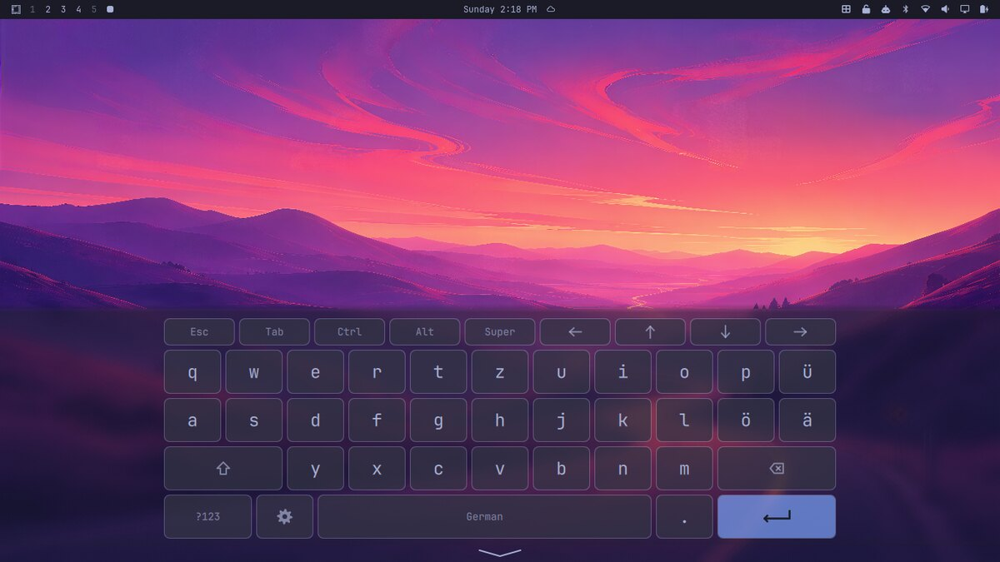
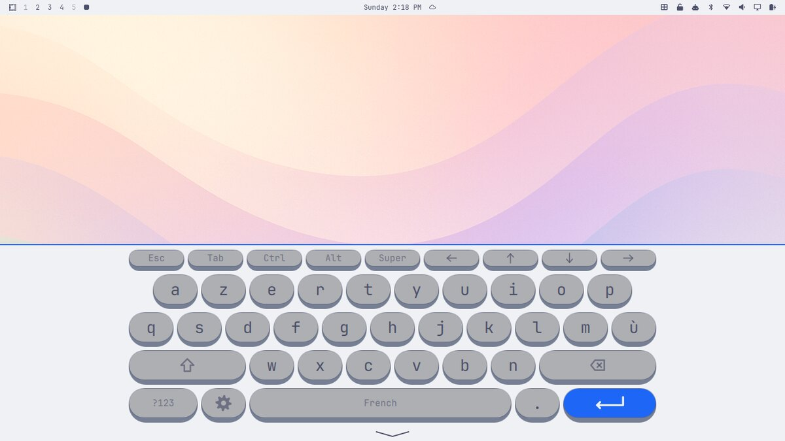
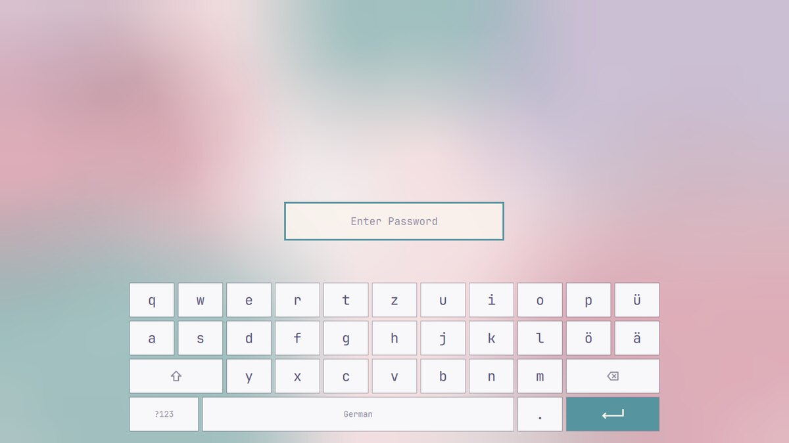
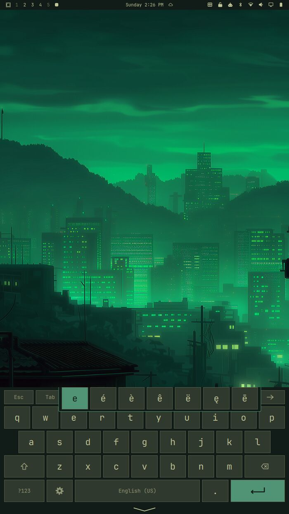
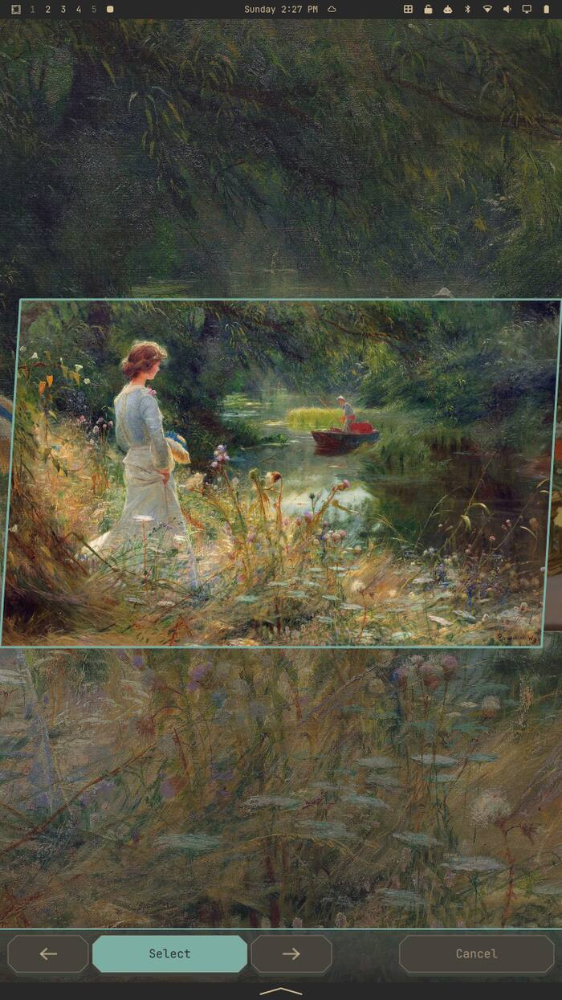

# Ragtop

**Made for convertibles, works for tablets, built for Omarchy.**

Fold the screen back, like a ragtop's roof — or take the keyboard off, which
the hardware reports the same way — and Ragtop switches your
[Omarchy 4](https://github.com/omacom/omarchy) desktop into a touch-friendly
mode: the screen rotates with the device, an on-screen keyboard themed like
the rest of Omarchy is one tap away, and the things that normally need a
keyboard shortcut or a mouse (moving windows between tiles, closing them,
typing into the Omarchy menu) work by touch. Put it back and everything
returns to normal.

## How it looks

The keyboard takes its colours from your Omarchy theme and its letters from
your Hyprland layout, so it matches whatever you already run. The look is
yours to change (see [Themes](#themes)).

| | | |
| --- | --- | --- |
|  |  |  |
| **Glass** on Tokyo Night — see-through keys over a blurred desktop, QWERTZ | **Typewriter** on Catppuccin Latte — raised keycaps, AZERTY with its short bottom row filled out | **The lock screen's own keyboard**, in the lock screen's palette |

Held upright, the same keyboard fills the width it is given:

| | |
| --- | --- |
|  |  |
| Hold a letter for its accents — the only way to reach é on some layouts | Choosing a background by touch, with the picker's own strip |

## Which tablets?

A convertible is a convertible whether its keyboard folds away or comes off.
Both report the same thing — a kernel tablet-mode switch — and Ragtop follows
either without knowing which it is looking at. That is now two machines: a
hinge that folds, and a slate that detaches.

| Kind | How it goes | |
| --- | --- | --- |
| **Convertible, hinged** — the screen folds back (Lenovo Yoga, HP x360, Dell 2-in-1) | Folding it past the point of no return flips the switch, and Ragtop follows. | Tested — Lenovo 300w Yoga Gen 4 |
| **Convertible, detachable** — the keyboard comes off (Surface-style, ThinkPad X12) | Detaching flips the same switch, so it behaves exactly as a hinge does. Ragtop keeps looking while no switch is there, so attaching a keyboard later is picked up too. | Tested — Surface Book 2 |
| **Slate** — no keyboard at all | Nothing to switch, and nothing needed: set **Tablet Mode › Always On** once and Ragtop stays in tablet mode for good. Setup saying it found no switch is the right answer here, not a fault. | Untested — reports welcome |

The only thing any of this decides is *how Ragtop learns it is in tablet
mode*. Everything after that — rotation, the keyboard, the handle, the
overlays, the lock screen — is the same on all three and needs a touchscreen
and nothing else.

### What it costs to have less

Nothing here is all-or-nothing. Each missing piece takes away exactly one
thing:

| Missing | What stops | What still works |
| --- | --- | --- |
| A tablet-mode switch, or read access to one | Tablet mode switching by itself | Everything, once **Tablet Mode › Always On** is set: the keyboard, rotation, the handle, the overlays |
| An accelerometer, or `iio-sensor-proxy` | The screen following the device; the rotation-lock button has nothing to lock | The keyboard, the handle, tablet mode, the overlays |
| `python-pywayland` | The keyboard sends no keys | Rotation, tablet mode, the shortcuts panel, the picker strip |
| `python-gobject` or fcitx5 | The keyboard coming up on its own at a text field | Bringing it up from the handle, and everything else |
| A touchscreen | Touch, obviously — but the keys, the handle and the panels all take a mouse | Rotation and tablet-mode switching, which is most of what a non-touch convertible wants |

A plain laptop with none of the above is not a failure case either: Ragtop
stays out of the way, the bar icons never appear, and nothing reserves screen
space until tablet mode turns on.

## Features

- **Follows the hardware.** Ragtop reads the tablet-mode switch, so tablet
  features appear when you fold the screen back — or when you take the
  keyboard off, which a detachable reports the same way. The switch is
  auto-detected whichever driver provides it.
- **Auto-rotation with a lock.** Screen and touch input rotate with the device
  (via `iio-sensor-proxy`). A bar button locks the orientation; the lock is
  remembered, and released automatically on the way back to laptop mode.
- **An on-screen keyboard that fits Omarchy.** Drawn by the Omarchy shell in
  your theme's colours and font, and restyled the moment you switch themes. Its
  background is see-through as its theme asks, and goes entirely when you make
  Omarchy's bar transparent.
- **The keys a desktop needs.** A slim extra row has Esc, Tab, Ctrl, Alt, Super
  and arrow keys. Modifiers are one-shot: tap Ctrl, then C, for Ctrl+C. Your
  Hyprland SUPER shortcuts work from it: tap Super, then Return, to open a
  terminal.
- **Your layout, any character.** The letter keys and the symbol pages follow
  your active Hyprland layout (QWERTZ, AZERTY, Cyrillic, Dvorak…), accents
  are a long press away, and characters your layout can't type (é on a US
  layout, emoji) still arrive.
- **Settings one tap away.** A gear key next to the space bar opens Ragtop's
  settings.
- **Window shortcuts panel.** Omarchy windows have no title bars and moving or
  resizing them needs SUPER plus a mouse, so a bar button opens a touch panel
  for focus, swap, close, fullscreen, float, split, pop out, resize, move to
  workspace 1–5, scratchpad and window cycling. Each button runs the same
  action as Omarchy's own keybinding.
- **Type into Omarchy's overlays by touch, if you want to.** The Omarchy menu,
  emoji picker, clipboard picker and polkit password prompt normally close when
  you tap the on-screen keyboard. Ragtop can fix that in tablet mode, bring
  the keyboard up with them, and keep them clear of it. It's off until you turn
  it on, one overlay at a time (see [Omarchy's overlays](#omarchys-overlays)).
- **Unlock without putting it back together, if you want to.** The lock screen hides every
  other window, the on-screen keyboard included, so Ragtop can give it a
  keyboard of its own in tablet mode. Also off until you turn it on.
- **Settings in the Omarchy menu,** under Setup › Tablet.

## Requirements

Only one thing is actually required: **Omarchy 4** (Hyprland 0.56+, the
Omarchy shell). Everything else buys a piece of Ragtop, and Ragtop runs
without any of it — it just does less, and the setup steps say which less.

| For | You need | Without it |
| --- | --- | --- |
| The on-screen keyboard | `python-pywayland` (official repositories) | No keys are sent; everything else still works |
| Rotation following the device | `iio-sensor-proxy` (official repositories), and an accelerometer | The screen stays where it is; rotation lock is moot |
| The keyboard coming up on text fields | `python-gobject`, and fcitx5 (which Omarchy ships) | Bring it up yourself with the handle |
| **Automatic** tablet mode | A kernel driver that reports a tablet-mode switch (`lenovo-ymc`, `intel-vbtn`, `intel-hid`, `asus-wmi`, `hp-wmi`, `thinkpad_acpi`…), and read access to it | Set **Tablet Mode › Always On** and Ragtop stays in tablet mode — which is the right answer on a slate anyway |
| Touch typing in Omarchy's overlays | `git`, to copy them | They behave as they ship |

Read access to the switch is a udev rule the setup offers to install, with
your password, through Omarchy's own prompt (see
[Tablet-mode detection](#tablet-mode-detection)). It is worth having on a
convertible and pointless on a slate.

## Tested hardware — feedback wanted

Ragtop has been tested on these:

| Device | Shape | Status |
| --- | --- | --- |
| Lenovo 300w Yoga Gen 4 | Convertible | Works. Folding switches modes, rotation follows the device |
| Microsoft Surface Book 2 | Detachable | Tablet mode and rotation work: **detaching the slate turns the keyboard on exactly as folding a hinge does**, reattaching turns it off, and rotation is correct. Touch itself doesn't work on this machine — see below |

Nothing in Ragtop is written for either model: the tablet-mode switch is
auto-detected, and rotation comes from the standard accelerometer stack.

**On a Surface, touch is the machine's problem, not Ragtop's.** Surface
hardware needs the [linux-surface](https://github.com/linux-surface/linux-surface)
kernel and firmware before its touchscreen works at all; a stock kernel gives
you a machine that detaches, rotates and runs Ragtop, with nothing to touch it
with. Worth knowing before you conclude the plugin is broken: check whether a
touch device exists at all with `hyprctl devices | grep -i touch`. **If you have a machine we haven't listed, please try it and open an issue**,
whether it works or not. Two machines is not a sample. There is a
[hardware report form](https://github.com/sclemance/ragtop/issues/new?template=hardware-report.yml)
that asks for exactly this.

What is most useful to hear about, roughly in order:

1. **Tablet mode.** Does folding or detaching turn it on, and does undoing
   that turn it off? Include what setup printed under "Looking for a
   tablet-mode switch" — and say so if it found none, because a machine with
   no switch is a useful data point too.
2. **Rotation.** Does the screen follow the device, the right way round, and
   do taps land where things are drawn? Getting the picture right but the
   touch rotated is a distinct and interesting failure.
3. **Everything else, in real use.** The keyboard coming up on a text field,
   SUPER shortcuts from it, the handle, the window shortcuts, the lock
   screen, the overlays if you turned any on. Tell us what you were doing,
   not only what broke.

Plus your device model, and anything that didn't work along with what you
expected instead.

Reports for detachables (tablets with a keyboard cover) are especially
welcome, since some signal the keyboard being detached differently.

## Install

```bash
omarchy plugin add https://github.com/sclemance/ragtop.git --enable
```

That is the whole of it: Ragtop notices it hasn't been set up and opens its
setup in the shell, which is where the rest happens.

Two packages come from Arch's own repositories and Ragtop can't install them
for you — the setup names them, and this is the line:

```bash
omarchy pkg add iio-sensor-proxy python-pywayland
```

If you'd rather do it in a terminal, or you're working on a checkout of your
own, `./install.sh` does the same things and links the checkout into Omarchy's
plugin folder. It takes `--yes`, `--no-restart`, `--overlays` and
`--no-overlays` for unattended runs.

### Setup without a terminal

The first time Ragtop runs on a machine nothing has been set up on, it opens
**setup in the shell** instead: a short series of steps that says what it is
about to touch, checks the packages it needs, offers the switch access rule
through Omarchy's own password prompt, and lets you pick which of Omarchy's
overlays to patch — each with a switch, and one that turns them all on.

It writes exactly what `install.sh` writes, through the same scripts, so a
machine set up either way ends up the same. Re-open it any time from
**Setup › Tablet › Run Setup**, or with `./ragtop setup`; it reflects what is
already on the machine, so you can use it to turn overlays on and off later.

The one thing it cannot do is install packages: it names what is missing, says
what each is for, and hands you the one-line `omarchy pkg add`. If something Ragtop set up
goes missing later, a "Ragtop needs setup" notification says what, and opens
the same steps.

The installer can be re-run safely. Options:

| Option | Effect |
| --- | --- |
| `--no-restart` | Don't restart the Omarchy shell at the end. |
| `--yes` | Don't ask anything; take the offer. Touch typing in Omarchy's overlays is the exception — it replaces part of Omarchy, so it stays off unless you ask for it. |
| `--no-udev` | Leave the switch access rule alone, installing or removing. |
| `--overlays` | Turn touch typing on in all of [Omarchy's overlays](#omarchys-overlays), without asking. |
| `--no-overlays` | Leave it off, without asking. |

### What the installer changes

Ragtop keeps as much as possible inside its own folder, but a few things
have to live elsewhere. The installer:

1. Links the plugin into `~/.config/omarchy/plugins/` and adds it to the bar.
2. Adds Ragtop's settings to the Omarchy menu, as a marked block at the
   top of `~/.config/omarchy/extensions/omarchy-menu.jsonc`.
3. Only if you can't read the tablet-mode switch, and only after asking:
   installs a udev rule, asking for your password through Omarchy's polkit
   prompt (see [Tablet-mode detection](#tablet-mode-detection)). The rule and
   everything that runs as root live in `udev-rule.sh`.
4. Offers, once and answering No by default, to turn on touch typing in all of
   [Omarchy's overlays](#omarchys-overlays) — its menu, pickers, password
   prompt and lock screen. Say no and nothing of Omarchy's is replaced; you
   can turn them on one at a time later.

Each of these is undone by the uninstaller, which removes the overlay clones
whether the installer or the menu turned them on. While running, Ragtop keeps
generated files in `~/.local/state/ragtop` and its settings in
`~/.config/ragtop`.

## Using it

In tablet mode, two icons appear in the bar:

| Icon | Does |
| --- | --- |
| Grid | Opens the window shortcuts panel. |
| Padlock | Locks or unlocks rotation. Highlighted while locked, and stays in the bar while locked, even in laptop mode. |

A slim handle, coloured like the bar, runs along the bottom of the screen in
tablet mode. Tap it to show the keyboard (it shows a wide ^) and tap it again
to hide it (a wide v). It reserves its own space, so windows never sit under
it; with the bar at the bottom, the handle sits just above the bar. While the
keyboard is open, the handle fades to the keyboard's background, so the two
read as one panel.

The keyboard also comes up on its own when you tap into a text field, or
switch to a window that takes typing, like a terminal. Ragtop learns about
this from fcitx5, the input method Omarchy already runs, by registering as its
on-screen keyboard while in tablet mode. It doesn't hide the keyboard when you
leave a text field: fcitx5's "hide" also fires on every keystroke from the
on-screen keyboard, so the two can't be told apart. Use the handle.
Apps that don't talk to an input method (some Electron and Chromium apps)
won't bring it up. To turn this off, tap **Setup › Tablet › Auto Keyboard** in
the Omarchy menu.

If you've turned on touch typing for them, the keyboard also comes up on its own
when you open the Omarchy menu, the emoji or clipboard picker, or a password
prompt, and goes away when you close it.

**Tapping the screen ends the screensaver.** Omarchy's screensaver is a
fullscreen terminal that quits when it reads a key, which a touchscreen never
sends it, so folded up there was no way to dismiss it but to open the laptop
and press a key. Ragtop covers it with a transparent catcher and turns a tap
into that key press. This one isn't limited to tablet mode — a touchscreen is
a touchscreen whichever way the hinge is, and reaching for the screen of an
open laptop should work too. It's specific to Omarchy's own screensaver (the
`org.omarchy.screensaver` window).

## The keyboard

Ragtop's keyboard is drawn by the Omarchy shell, so it follows your theme's
colours and font, and the Transparency setting, without restarting. It has:

- **An extra row** of Esc, Tab, Ctrl, Alt, Super and the arrow keys. Held
  arrows and Backspace repeat.
- **One-shot modifiers:** tap Ctrl, then C, for Ctrl+C, and the Ctrl turns
  off by itself. Tap a modifier a second time to lock it on until you tap it
  again, however long you take over it.
- **Your layout's letters:** the letter keys follow the active Hyprland
  layout, and the space bar shows its name. **Hold the space bar** to switch
  to another of the layouts you have configured in Hyprland, if you have
  more than one. It is Hyprland's own switch, so everything follows it.
- **AltGr, where your layout has one.** A German q carries `@`, a French a
  carries `æ`, and every cap prints its AltGr character small in the corner
  the way a real keycap does. Tap AltGr and the caps switch to it, the way
  Shift switches them to capitals. The key only appears on a layout that has
  a third level, so a plain US keyboard is not given one that does nothing.
- **Hold a letter for its accents:** e gives é è ê ë, c gives ç, s gives ß.
  Slide onto the one you want and let go; let go where you started for the
  plain letter, or slide off the popup to take nothing. The letters your own
  layout carries come first — on AZERTY, which keeps é, è, ç and à on its
  number row where the letter rows can't reach them, this is the only way to
  type them.
- **Your layout's symbols:** the two symbol pages carry the same punctuation
  whatever you type in, and pick up what your layout adds on top — § and ° on
  a German keyboard, ¡ and ¿ on a Spanish one, № and ₽ on a Russian one, ₹ on
  an Indian one. Up to four go in the free slots on the pages' third rows; a
  US layout adds nothing, so its pages look exactly as they always did.
- **Any character** your layout can't type still arrives, and every key types
  what it shows whatever your Hyprland layout is.
- **A gear key** that opens Ragtop's own controls over the keyboard, so the
  keys stay in view while you change them. See below.

`keyboard-helper.py` sends the keys: it registers a Wayland virtual keyboard
with the same keymap as your physical keyboard, which is also why your SUPER
shortcuts work from it. For keybindings or scripts:

```bash
omarchy-shell ragtop toggleKeyboard    # also showKeyboard, hideKeyboard
```

### The controls

The gear on the keyboard opens a small panel that sits below Omarchy's bar
and holds what you reach for while actually holding the machine. The keyboard
stays drawn underneath, so changing the theme or the key size shows you the
result as you do it. Tap the gear again, or anywhere on the keyboard, to put
it away.

| Control | What it does |
| --- | --- |
| Theme | Steps through your themes, redrawing the keyboard behind each one |
| Screen Rotation | Locked, Unlocked, or Automatic, which turns while the machine is folded and holds still while it is a laptop |
| Keyboard Size | The five-step nudge against whatever size the theme asks for |
| Auto-expand keyboard on text fields | Whether the keyboard comes up by itself |
| Settings | Opens Setup › Tablet for everything else |

Tablet Mode is deliberately not here. Turning it off takes the keyboard away
with it, and the way back would be the menu this panel exists to save you
from. It stays in Setup › Tablet, where you can reach it without a keyboard.

**Screen rotation** is also in the bar, always visible, and the button there
cycles the same three states. Rotation follows the sensor whether or not the
machine is folded, so the screen can start turning with the keyboard
attached, which is why Unlocked and Automatic are different things.

### Keybindings

Ragtop writes no keybindings of its own. If you want them, these are the ones
worth having, in `~/.config/hypr/bindings.lua`:

```lua
-- The keyboard, whatever the tablet switch thinks
bind("SUPER SHIFT", "K", "exec", "omarchy-shell ragtop toggleKeyboard")
-- The panel the gear opens
bind("SUPER SHIFT", "T", "exec", "omarchy-shell ragtop toggleControls")
-- Locked, unlocked, automatic, round again
bind("SUPER SHIFT", "R", "exec", "omarchy-shell ragtop cycleRotation")
-- Bigger and smaller keys
bind("SUPER SHIFT", "equal", "exec", "omarchy-shell ragtop growKeyboard")
bind("SUPER SHIFT", "minus", "exec", "omarchy-shell ragtop shrinkKeyboard")
```

Check them against Omarchy's own bindings before you add them, since nothing
here reserves a chord.

Everything on that socket takes no argument, deliberately: `showKeyboard`,
`hideKeyboard`, `toggleKeyboard`, `keyboardVisible`, `openSetup`,
`closeSetup`, `toggleControls`, `cycleRotation`, `growKeyboard`,
`shrinkKeyboard`, `rotationState`, `keyboardState` and `pickerState`. None of
them can be handed a value to type, which is the point.

### The keyboard's look

Ragtop follows your Omarchy theme: colours, type scale, spacing and borders
all come from the theme's own tokens, so switching themes restyles the
keyboard with it. The settings only say *how* to use them, and each one is a
row in the Omarchy menu under **Setup › Tablet**:

| Row | Choices |
| --- | --- |
| Tablet Mode | Automatic (follow the hardware switch), On, or Off |
| Auto Keyboard | Whether the keyboard comes up by itself on a text field |
| Theme | The keyboard's whole look, from a theme file |
| Key Size | Smallest, Smaller, Regular, Larger, Largest — against whatever size the theme asks for, and the labels scale with the keys |
| System Overlays | Touch typing in each of Omarchy's overlays, one at a time |
| Run Setup | Opens setup in the shell |

Theme, Key Size and the keyboard's own auto-expand are also on the panel the
gear opens, which is the quicker way to them while you are holding the
machine.

What a key looks like — its shape, relief, fill, how see-through it is, the
background behind it and the top edge — belongs to the theme, so it is set in
a theme file and not row by row. What stays here is the one thing no theme
author can know: how big the keys have to be on your screen for your eyes.
Key Size is a nudge against whatever the theme asked for, and it is yours, so
applying a theme never resets it.

**Whether the keyboard has a background at all is Omarchy's call, not a
setting here.** Double-tap the bar to make it transparent and the keyboard's
background goes with it, so the keys float over the desktop the way the bar
does. Make the bar solid again and the background comes back as the theme
asked for it.

Whatever a key looks like, a touch goes to the nearest key, so no shape
makes keys harder to hit.

**Edge** sets how the keyboard's top edge meets the desktop. Border gives it
the same border your tiled windows have, taken from the Omarchy theme itself
(the shell's own active-window border spec), so it follows a theme switch
live, gradients included. Fade fades the background out over `edge-fade`
pixels. None leaves a hard edge.

### Themes

A Ragtop theme is a small TOML file of those same settings, never code. It
sets the keyboard's **form**. Its colours keep coming from your Omarchy
theme, which is why any Ragtop theme looks right on any Omarchy one.

Applying one **writes its values into your settings**, so afterwards every
menu row shows what the keyboard is actually doing. A theme is a starting
point, not a layer that overrides you.

They are laid out the way Omarchy lays out its own themes, in the same two
places, and yours wins where the names match. Ragtop's are in
`themes/<name>/ragtop.toml` (Omarchy, Soft, Typewriter, Glass, Industrial).
Put your own in `~/.config/ragtop/themes/<name>/ragtop.toml` and apply it
from the menu or with `./ragtop theme apply <name>`:

```toml
name = "Chunky"

shape = "rounded"
relief = "raised"
fill = "light"
size = 115
background = "tint"
transparency = 0
edge = "border"
labels = "large"
depth = 6
```

Besides the menu rows, a theme can set the details that don't deserve one:

| Field | Values | Default |
| --- | --- | --- |
| `labels` | label size on Omarchy's type scale: `small`, `normal`, `large` | `normal` |
| `depth` | Raised keys: how far the key's side shows, 0–10 | 4 |
| `chamfer` | Angular: how much of each corner is cut, 0–20 | 8 |
| `edge-fade` | pixels the background fades over with Edge set to Fade, 0–24 | 8 |
| `size` | key size as a percentage of the usual, 60–160 | 100 |
| `transparency` | the background over the desktop, 0 solid to 100 gone | 0 |
| `key-transparency` | the keys over that background, 0 solid to 100 gone | 0 |
| `special-keys` | how the keys that type nothing sit against the letters: `darker`, `lighter`, `off` | `darker` |
| `blur` | blur what's behind the keyboard (see below) | `false` |

To leave the Omarchy theme behind for one part of the look, a Ragtop theme
can also set these outright. Only what you set stops following it:

| Field | Values |
| --- | --- |
| `key-color`, `label-color` | a palette role (`foreground`, `background`, `accent`, `urgent`) or a hex colour |
| `key-fill-alpha` | 0–1, how strong the key fill is |
| `border-width` | 0–4 |
| `radius` | corner radius in pixels, 0–30 |

Anything missing, unknown or out of range is ignored, so a stray file can't
break the keyboard. All of this lands in `~/.config/ragtop/settings.conf`,
which you can also edit directly.

**Blur** is Hyprland's, and Omarchy ships with it turned off. A theme with
`blur = true` turns it on at runtime, for Ragtop's keyboard and its handle
only: Hyprland is told to leave every window unblurred, so your see-through
terminals stay as they are. Turning blur off again restores it, and nothing
is written to your Hyprland config, so `hyprctl reload` clears it either
way. If you have blur on yourself, Ragtop leaves your setup alone and just
blurs behind its keyboard.

The lock screen's keyboard takes the shape, fill and measurements too,
checked again by its own code, but never the colours or the background.

## Omarchy's overlays

Omarchy's menu, pickers and polkit prompt are full-screen surfaces that take
*exclusive* keyboard focus, and Hyprland sends every touch to such a surface
before checking anything stacked above it. So a tap on the on-screen keyboard
lands on the overlay and closes it. This can't be fixed from the keyboard's
side.

The theme and background pickers (both Omarchy's image picker) have the same
problem and one of their own: see [The theme and background pickers](#the-theme-and-background-pickers).

Ragtop can replace them with clones (made with Omarchy's own
`omarchy plugin clone`) that change two lines, and only in tablet mode: they
take focus *on demand*, which still gets focus when they open and still
receives typed keys, and they respect the keyboard's reserved space so they
sit above it. In laptop mode they behave exactly as shipped; on-demand focus
there could let a window under the mouse on another monitor take focus away.
The menu's clone carries one more change, for a reason that has nothing to do
with touch: see [The menu's Apps list](#the-menus-apps-list).

Replacing part of Omarchy is your call, so each clone is off until you turn it
on. The installer offers all of them once, with the trade-off below and No as
the default answer. Afterwards, in the Omarchy menu, go to
**Setup › Tablet › System Overlays** and
tap an overlay to turn it on or off (✓ means on). The shell restarts to load
the change. From a terminal, the same thing is:

```bash
./ragtop overlay toggle menu        # or: enable, disable; menu, emojis, clipboard,
                                    # polkit, image-picker, lock
./ragtop overlay status             # which are on, and in sync with Omarchy?
./ragtop overlay sync               # re-clone any that Omarchy or Ragtop moved on from
```

What turning one on means:

- **It stops getting Omarchy's fixes directly.** A clone is a copy, so once it's
  on, Omarchy's updates to the original don't reach it by themselves. A hook
  re-clones it after every `omarchy update`, but refuses to replace a clone
  you've edited yourself, and tells you so.
- **In tablet mode it doesn't hold the keyboard to itself.** That's the fix,
  but it also means another window could take keyboard focus while the overlay
  is open, for example one under the mouse on a second monitor, and receive
  what you type.
- **The password prompt matters most.** Its clone keeps its authentication role
  (Omarchy passes a clone its original's capabilities), but its code then lives
  in your user-writable config instead of the root-owned system folder, and the
  point above applies to your password. Anything running as you could already
  interfere with your session in other ways, but it's the one to think about
  before turning on.

### The menu's Apps list

Omarchy 4 (checked on 4.0.4) doesn't give a third-party menu plugin its application
library. The plugin's manifest reaches the shell's plugin API through an
`Instantiator`, and after that round trip `Array.isArray(manifest.kinds)` is
false, so the shell decides the plugin isn't a menu and builds it without one.
Omarchy's own menu is unaffected, because it gets the shell itself. Any cloned
menu, Ragtop's or anyone's, comes up with **Apps** empty.

So the menu clone carries a third change: when the shell hands it no
application library, it loads Omarchy's own `AppLibrary.qml` — the same file
the shell uses, which stands on its own — and goes back to the one the shell
provides the moment there is one. Apps, its icons and launching all work the
way they do in Omarchy's menu; the only cost while the fallback is in use is
one extra icon scan.

### The theme and background pickers

Both are Omarchy's image picker (**Image Picker** in the same menu), and it
isn't a keyboard problem: it shows a carousel of previews, and the keyboard
covers the very preview you're choosing by. So Ragtop keeps the keyboard off
it and, with the clone on, puts the four keys the carousel actually listens
to in a strip along the bottom instead:

```
   [ ◀ ]   [ Select ]   [ ▶ ]      [ Cancel ]
```

◀ and ▶ step through the images and repeat if you hold them; Select applies
the one in the middle; Cancel closes without changing anything. The strip is
drawn from the keyboard's own theme and reserves its space, so the carousel
sits above it. The keyboard handle stays, so you can still bring the keyboard
up to type a filter where the picker takes one.

Without the clone Ragtop can only get out of the way: a stock picker takes
every touch on the screen, so the strip's own taps would never reach it, and
even a tap on the keyboard would land on the picker and throw it away. So
whether or not you turn the clone on, while a picker is open the keyboard
stays down and the handle goes with it, leaving the carousel's own slices to
tap: tap one to select it, tap the middle one again to apply.

One cost specific to this clone: Omarchy warms the picker's thumbnails
through an IPC call that names the built-in plugin directly, so with any
clone in place that warm-up does nothing and the first open is slower. The
picker itself opens, works and closes normally.

### The lock screen

The lock screen is different: while it's up, Hyprland shows nothing else at
all, so no on-screen keyboard can appear over it. Its clone (**Lock Screen**
in the same menu) keeps Omarchy's lock screen as it is and adds a keyboard of
its own along the bottom, in tablet mode only: your layout's letters with
Shift (tap twice for Caps), and two pages of digits and symbols, which pick
up your layout's own symbols the same way the desktop keyboard's do. Holding
a letter offers its accents there too — a password is typed in characters,
and on some layouts é or ß is only reachable that way. Its popup sits on a card of
its own, opaque whatever the theme's key transparency is, so the letter you
are picking stays legible against the keys it covers. The keys edit
the password the same way typing does, and Omarchy checks it as usual. The
keyboard itself is `LockKeyboard.qml` in Ragtop's folder, which the clone
loads.

It's shaped like the desktop keyboard but drawn in the lock screen's own
colours, and it's deliberately a separate, self-contained file: it shares no
code with the desktop keyboard, sends no key events and has no Ctrl, Alt or
Super, so nothing added to the desktop keyboard reaches the lock screen by
accident, and there's one short file to review. It learns your layout's letters
and symbols from `$XDG_RUNTIME_DIR/ragtop-layout.json`, which Ragtop's service
writes, and falls back to US if that's missing or malformed. What it takes
from there is data, never code, and it re-checks all of it by its own rules:
a symbol has to be one printable character or it's dropped.

The screen doesn't rotate while it's locked, with or without this: Omarchy's
lock screen isn't redrawn for a rotated display, although touches would be
rotated, so taps would land in the wrong place. The lock screen keeps the
orientation it was locked in, and the screen catches up when you unlock.

The same points apply as for the password prompt, since this is where you type
your login password: the clone and the keyboard live in your user-writable
config. Keys light up when tapped, as on any on-screen keyboard, so mind who's
watching. Try it the first time in laptop mode with Tablet Mode set to
Always On, so the physical keyboard is there if anything goes wrong.

## Settings

Ragtop's settings are in the Omarchy menu under **Setup › Tablet**, which
the gear key on the on-screen keyboard opens directly:

| Setting | Default | Where |
| --- | --- | --- |
| Tablet mode: Automatic (follow the hardware — folding or detaching), Always On or Always Off | Automatic | Setup › Tablet › Tablet Mode |
| Keyboard comes up on text fields | on | Setup › Tablet › Auto Keyboard |
| A saved look, which writes the rows below (see [Themes](#themes)) | Omarchy | Setup › Tablet › Theme |
| Key size against the theme's, in five steps from Smallest to Largest | Regular | Setup › Tablet › Key Size |
| Key shape, relief, fill, transparency, background and top edge | set by the theme | `themes/<name>/ragtop.toml` |
| Whether the keyboard has a background | follows the bar | double-tap Omarchy's bar |
| Touch typing in each overlay, the picker nav strip, and the lock screen's keyboard | off | Setup › Tablet › System Overlays (see [Omarchy's overlays](#omarchys-overlays)) |

The bar follows Style › Bar › Transparency, which a double tap on it
toggles: a transparent bar takes the keyboard's background away entirely, and
a solid one gives back whatever the theme asked for. The handle along the
bottom follows the bar the same way while the keyboard is closed, and the
keyboard while it's open.

From a terminal, `./ragtop <setting> ...` does the same as the menu rows:
`tablet-mode set auto|on|off`, `auto-show toggle` (or `enable`, `disable`),
`size-adjust set smallest|smaller|regular|larger|largest`,
`rotation set locked|unlocked|auto`, and
`theme apply <name>` (`theme list` shows them). Settings other than the
overlays are kept in `~/.config/ragtop/settings.conf`, and changes apply
straight away. The rest of the look has no verb, because it is the theme's
to set.

A couple more live in Ragtop's bar entry in `~/.config/omarchy/shell.json`:

| Setting | Default | Meaning |
| --- | --- | --- |
| `tabletSwitchDevice` | blank | Input device to read the tablet-mode switch from. Blank means auto-detect. |
| `rotationLocked` | `false` | Saved by the padlock button. |

## Tablet-mode detection

Ragtop picks the input device that advertises the standard tablet-mode
switch (`SW_TABLET_MODE`) and watches it, so a fold registers immediately.
If none exists yet, it
keeps looking every 10 seconds, which covers keyboards that attach later.

If your device has no usable switch, or you want the touch controls with the
keyboard attached, set **Setup › Tablet › Tablet Mode** to **Always On**.
Always On and Always Off stop Ragtop reading the switch at all.

If tablet mode is never detected:

- Check the installer's "Looking for a tablet-mode switch" output. No device
  means your driver doesn't report the switch; setting `tabletSwitchDevice`
  won't help then.
- A device that isn't readable is usually owned by the `input` group. Rather
  than joining that group, which would let any program you run read every
  keyboard, the installer offers to install
  `/etc/udev/rules.d/70-ragtop-tablet-switch.rules`:

  ```
  SUBSYSTEM=="input", KERNEL=="event*", ENV{ID_INPUT_SWITCH}=="1", ENV{ID_INPUT_KEY}!="1", TAG+="uaccess"
  ```

  It gives the user logged in at the machine read access to switch devices
  only (tablet mode, lid, headphone jack), never keyboards, and takes effect
  without logging out. The uninstaller removes it.
- Rotation is separate: it needs `iio-sensor-proxy` to see your accelerometer
  with the right orientation, which is handled by your distribution's hardware
  database, not Ragtop.

## Troubleshooting

- **Changes to Ragtop's code don't take effect.** Run
  `omarchy-restart-shell`. Omarchy's plugin reload (`omarchy-shell shell
  rescanPlugins`) can keep running previously compiled code.
- **The bar icons are missing.** Look for a load error:
  `quickshell log -r '*=true' /run/user/$UID/quickshell/by-pid/$(pgrep -f 'quickshell.*omarchy/shell')/log.qslog | grep 'sclemance.ragtop failed'`
- **The keyboard doesn't type.** Check that `python-pywayland` is installed:
  the setup notification says so if it isn't.

## Uninstall

```bash
./install.sh uninstall
```

This removes any overlay clones you turned on, Ragtop's rows in the Omarchy
menu, the switch access rule, Ragtop's settings and generated files, and the
plugin itself (or unlinks it, if it was linked from a checkout).

## Language

Ragtop is English-only, and so is Omarchy: the shell has no translation layer
yet, and the proposals for one are still open. That's worth fixing one day —
in 2026 localization isn't as hard as it used to be, and Linux is for
everyone, not just English speakers — so the point for now is to not get in
the way of it. [LOCALIZATION.md](LOCALIZATION.md)
records where that stands, which of Ragtop's strings are prose and which are
protocol that must never be translated, and what would change here once a
standard settles.

The keyboard itself is mostly language-agnostic already — its letters, symbols
and accents come from your active Hyprland layout, and its key glyphs are
drawn rather than written.

## Upgrading from an older Ragtop

0.39 renamed presets to themes and moved them from `presets/<name>.json` to
`themes/<name>/ragtop.toml`, turned key size and the two transparencies from
words into numbers, and changed which rows live in the menu. A machine that
upgrades in place is brought up to date the first time the shell starts
afterwards, and told so once:

- **Settings** keep their meaning. `transparency=high` becomes `50`,
  `size=large` becomes `115`, `preset=` becomes `theme=`, and the modifier
  mode setting is dropped, since one-shot now locks on a second tap.
- **Your own presets** in `~/.config/ragtop/presets/` become themes in
  `~/.config/ragtop/themes/<name>/ragtop.toml`, converted as above. The
  originals are left where they are, and a theme you already have of the same
  name is never overwritten.
- **The menu** is rewritten, because the old rows call commands this version
  no longer answers.

None of it runs twice. If you would rather do it by hand, `./ragtop migrate`
is the same thing.

## Versioning and updates

`omarchy plugin update sclemance.ragtop` fast-forwards this checkout to the
default branch: it shows you the diff first, validates the manifest
afterwards, and rolls back if that fails. There are no release channels —
whatever is on the branch is what you get — so the branch is kept shippable
and every push is, in effect, a release.

The version in `manifest.json` is required — `omarchy plugin validate` refuses
a manifest without one — but Omarchy itself never shows it: not in
`omarchy plugin list`, not in its JSON. So it is here for people, in the
release tags and in bug reports. Ragtop is **in beta**: it runs two machines every day, but it wants strangers
to break it. Bugs and hardware reports are the point of this stage — and so
is telling us what is awkward. Features will change and be added while it is
in beta, because usability is not a thing you finish before shipping and then
stop doing; 1.0.0 is simply the first release that isn't beta. The version is **0.x while
that is true**,
and says so honestly: the settings file, the `ragtop` command and the rest
are still moving. The first published release is 1.0.0, tagged, and from
then on:

| | |
| --- | --- |
| **patch** | a fix |
| **minor** | a new capability, or a changed default |
| **major** | a break in something you can build a habit or a script on: the keys and values in `settings.conf`, the `ragtop` verbs, the `setup.tablet.*` menu ids, the layer namespaces, the `ragtop` IPC target and its functions, the files in `$XDG_RUNTIME_DIR`, and the installer's flags |

Everything else — the QML, how a key is drawn, what the helper prints to
itself — is Ragtop's own business and can change in a patch.

## Credits and licensing

- The on-demand focus fix for Omarchy's overlays follows
  [Gimbal](https://github.com/mechanicsunlocked/gimbal) (MIT), a tablet mode
  for the Framework Laptop 12.
- `protocols/virtual-keyboard-unstable-v1.xml` is the Wayland virtual keyboard
  protocol (MIT). Its Python bindings are generated on your machine on first run.
- Clones of Omarchy's overlays are made on your machine from Omarchy's
  MIT-licensed source.
- Ragtop itself is released under the [MIT License](LICENSE).
