<h1 align="center">
  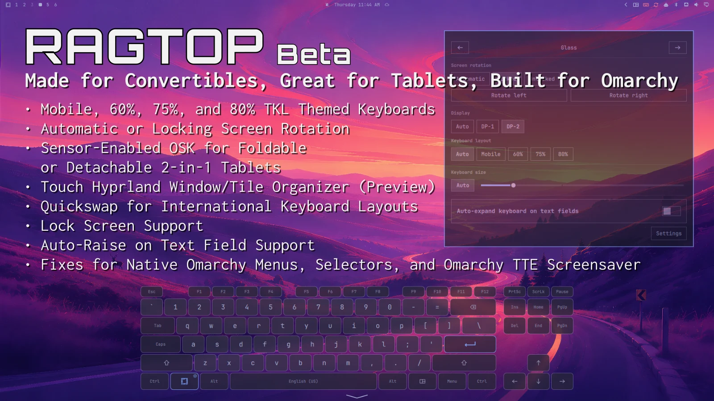
</h1>

Fold the screen back, like a ragtop's roof, or take the keyboard off, which
the hardware reports the same way, and Ragtop switches your
[Omarchy 4](https://github.com/omacom/omarchy) desktop into a touch-friendly
mode: the screen rotates with the device, an on-screen keyboard themed like
the rest of Omarchy is one tap away, in a phone layout or a real one, and the
things that normally need a keyboard shortcut or a mouse work by touch. Your
windows can be rearranged by dragging them around, and the Omarchy menu can be
typed into. Put it back and everything returns to normal.

Two more documents sit beside this one. **[THEMING.md](THEMING.md)** is every
field a keyboard theme may set. **[ARCHITECTURE.md](ARCHITECTURE.md)** is how
Ragtop works underneath: the layer surfaces, the hardware it reads, and how
it types.

**Jump to:** [How it looks](#how-it-looks) &middot;
[Will it work on mine?](#which-tablets) &middot; [Features](#features) &middot;
[Install](#install) &middot; [The keyboard](#the-keyboard) &middot;
[Tiling mode](#tiling-mode-preview) &middot; [Settings](#settings) &middot;
[Troubleshooting](#troubleshooting)

## How it looks

The keyboard takes its colours from your Omarchy theme and its letters from
your Hyprland layout, so it matches whatever you already run. The look is
yours to change (see [Themes](#themes)).

| | | |
| --- | --- | --- |
| 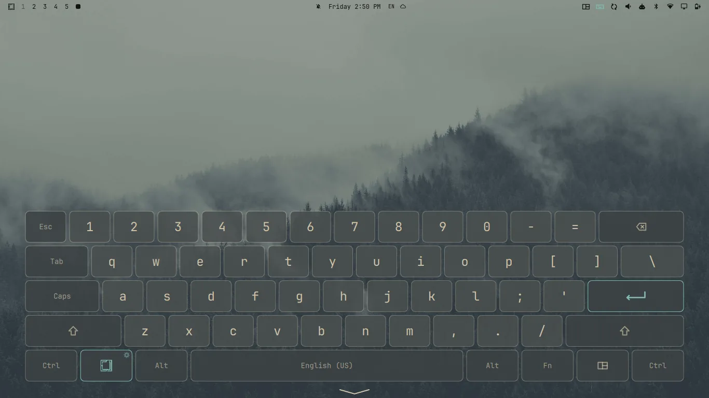 | 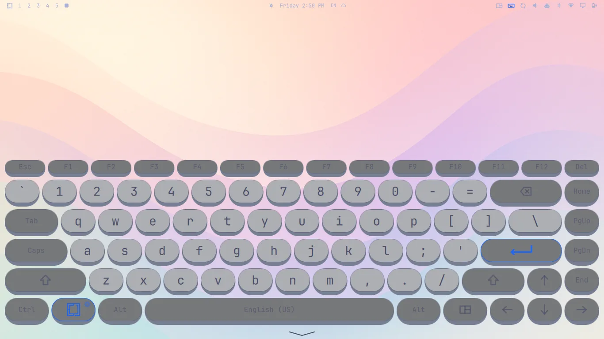 | 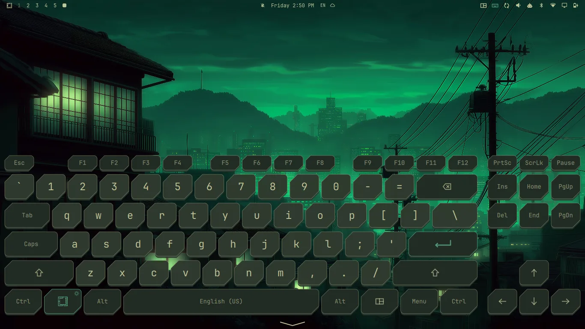 |
| **Soft** on Everforest, 60% | **Typewriter** on Catppuccin Latte, 75% | **Spaceship** on Osaka Jade, tenkeyless |

**A Ragtop theme sets the shape of a key and your Omarchy theme sets its
colour**, which is why any Ragtop theme looks right on any Omarchy one. **It
is not one keyboard** either: Ragtop draws whichever board the screen can
carry, from a tenkeyless down to the phone style, and changes its mind when
the screen turns. More of it further down, beside what it shows:
[the boards](#which-board), [themes](#themes),
[accents](#what-every-board-has), [the pickers](#the-theme-and-background-pickers),
[the lock screen](#the-lock-screen) and [tiling mode](#tiling-mode-preview).

## Which tablets?

A convertible is a convertible whether its keyboard folds away or comes off.
Both report the same thing, a kernel tablet-mode switch, and Ragtop follows
either without knowing which it is looking at. That is now two machines: a
hinge that folds, and a slate that detaches.

| Kind | How it goes | |
| --- | --- | --- |
| **Convertible, hinged**, the screen folds back (Lenovo Yoga, HP x360, Dell 2-in-1) | Folding it past the point of no return flips the switch, and Ragtop follows. | Tested: Lenovo 300w Yoga Gen 4 |
| **Convertible, detachable**, the keyboard comes off (Surface-style, ThinkPad X12) | Detaching flips the same switch, so it behaves exactly as a hinge does. Ragtop keeps looking while no switch is there, so attaching a keyboard later is picked up too. | Tested: Surface Book 2 |
| **Slate**, no keyboard at all | Nothing to switch, and nothing needed: set **Tablet Mode › Always On** once and Ragtop stays in tablet mode for good. Setup saying it found no switch is the right answer here, not a fault. | Untested: reports welcome |

The only thing any of this decides is *how Ragtop learns it is in tablet
mode*. Everything after that, rotation, the keyboard, the handle, the
overlays and the lock screen, is the same on all three and needs a touchscreen
and nothing else.

### What it costs to have less

Nothing here is all-or-nothing. Each missing piece takes away exactly one
thing:

| Missing | What stops | What still works |
| --- | --- | --- |
| A tablet-mode switch, or read access to one | Tablet mode switching by itself | Everything, once **Tablet Mode › Always On** is set: the keyboard, rotation, the handle, the overlays |
| An accelerometer, or `iio-sensor-proxy` | The screen following the device, and with no accelerometer the bar's rotation button goes with it. Set rotation to Locked and turn it a quarter turn at a time from the controls panel instead, which is Hyprland and needs no sensor | The keyboard, the handle, tablet mode, the overlays |
| `python-pywayland` | The keyboard sends no keys | Rotation, tablet mode, tiling mode, the picker strip |
| `python-gobject` or fcitx5 | The keyboard coming up on its own at a text field | Bringing it up from the handle, and everything else |
| A touchscreen | Touch, obviously, but the keys, the handle and the panels all take a mouse | Rotation and tablet-mode switching, which is most of what a non-touch convertible wants |

A plain laptop with none of the above is not a failure case either: Ragtop
stays out of the way, the bar icons never appear, and nothing reserves screen
space until tablet mode turns on.

## Features

- **Follows the hardware.** Ragtop reads the tablet-mode switch, so tablet
  features appear when you fold the screen back, or when you take the
  keyboard off, which a detachable reports the same way. The switch is
  auto-detected whichever driver provides it.
- **Auto-rotation with a lock.** Screen and touch input rotate with the device
  (via `iio-sensor-proxy`). A bar button cycles Automatic, Locked and
  Unlocked, the choice is remembered, and while it is Locked there are two
  buttons to turn the screen a quarter turn by hand.
- **An on-screen keyboard that fits Omarchy.** Drawn by the Omarchy shell in
  your theme's colours and font, and restyled the moment you switch themes. Its
  background is see-through as its theme asks, and goes entirely when you make
  Omarchy's bar transparent.
- **Four boards, and it picks one.** Mobile is the phone style, three letter
  rows with the symbols behind `?123`. 60%, 75% and 80% are the real thing,
  with every symbol where your fingers already know it is, a function row and
  a nav cluster on the larger two, and an **Fn** layer on the 60% that reaches
  what it has no room for. Automatic draws the widest board the screen can
  carry and changes its mind when you turn it, so folding into portrait steps
  down a board instead of shrinking the keys. Pick one by name and it is kept.
  See [Which board](#which-board).
- **The keys a desktop needs.** Esc, Tab, Ctrl, Alt, Super, the arrows and
  the function keys, in their own places on a real board and on a slim extra
  row on the mobile one. Modifiers are one-shot: tap Ctrl, then C, for Ctrl+C,
  and tap one twice to lock it on. Your Hyprland SUPER shortcuts work from it:
  tap Super, then Return, to open a terminal.
- **Your layout, any character.** The letter keys and the symbol pages follow
  your active Hyprland layout (QWERTZ, AZERTY, Cyrillic, Dvorak…), accents
  are a long press away, and characters your layout can't type (é on a US
  layout, emoji) still arrive.
- **Settings one hold away.** Hold the Super key, next to the space bar, and
  Ragtop's controls come up over the keyboard: the theme, which board, key
  size, rotation, and which monitor Ragtop lives on where you have more than
  one. The keyboard stays drawn underneath, so you see what you changed.
- **Tiling mode, as a preview.** Omarchy windows have no title bars and moving
  or resizing them needs SUPER plus a mouse. Tiling mode puts a transparent
  layer over the real windows so you can tap one to focus it, hold and drag it
  onto another to swap them, and drag the squares and bars on its edges to
  resize. The windows are the controls, at full size, with their content
  visible and reflowing as you work. It is solid on one screen and unfinished
  on more than one. See [Tiling mode](#tiling-mode-preview).
- **Type into Omarchy's overlays by touch, if you want to.** The Omarchy menu,
  emoji picker, clipboard picker and polkit password prompt normally close when
  you tap the on-screen keyboard. Ragtop can fix that in tablet mode, bring
  the keyboard up with them, and keep them clear of it. It's off until you turn
  it on, one overlay at a time (see [Omarchy's overlays](#omarchys-overlays)).
- **Unlock without putting it back together, if you want to.** The lock screen
  hides every other window, the on-screen keyboard included, so Ragtop can
  give it a keyboard of its own in tablet mode. Also off until you turn it on.
- **Settings in the Omarchy menu,** under Setup › Tablet.

## Requirements

Only one thing is actually required: **Omarchy 4** (Hyprland 0.56+, the
Omarchy shell). Everything else buys a piece of Ragtop, and Ragtop runs
without any of it. It just does less, and the setup steps say which less.

| For | You need | Without it |
| --- | --- | --- |
| The on-screen keyboard | `python-pywayland` (official repositories) | No keys are sent, everything else still works |
| Rotation following the device | `iio-sensor-proxy` (official repositories), and an accelerometer | The screen stays where it is until you turn it by hand from the controls panel |
| The keyboard coming up on text fields | `python-gobject`, and fcitx5 (which Omarchy ships) | Bring it up yourself with the handle |
| **Automatic** tablet mode | A kernel driver that reports a tablet-mode switch (`lenovo-ymc`, `intel-vbtn`, `intel-hid`, `asus-wmi`, `hp-wmi`, `thinkpad_acpi`…), and read access to it | Set **Tablet Mode › Always On** and Ragtop stays in tablet mode, which is the right answer on a slate anyway |
| Touch typing in Omarchy's overlays | `git`, to copy them | They behave as they ship |

Read access to the switch is a udev rule the setup offers to install, with
your password, through Omarchy's own prompt (see
[Tablet-mode detection](#tablet-mode-detection)). It is worth having on a
convertible and pointless on a slate.

## Tested hardware, feedback wanted

Ragtop has been tested on these:

| Device | Shape | Status |
| --- | --- | --- |
| Lenovo 300w Yoga Gen 4 | Convertible | Works. Folding switches modes, rotation follows the device |
| Microsoft Surface Book 2 | Detachable | Tablet mode and rotation work: **detaching the slate turns the keyboard on exactly as folding a hinge does**, reattaching turns it off, and rotation is correct. Touch itself doesn't work on this machine. See below |

Nothing in Ragtop is written for either model: the tablet-mode switch is
auto-detected, and rotation comes from the standard accelerometer stack.

**On a Surface, touch is the machine's problem, not Ragtop's.** Surface
hardware needs the
[linux-surface](https://github.com/linux-surface/linux-surface) kernel and
firmware before its touchscreen works at all, and a stock kernel gives you a
machine that detaches, rotates and runs Ragtop, with nothing to touch it with.
Worth knowing before you conclude the plugin is broken: check whether a touch
device exists at all with `hyprctl devices | grep -i touch`. **If you have a
machine we haven't listed, please try it and open an issue**, whether it works
or not. Two machines is not a sample. There is a [hardware report
form](https://github.com/sclemance/ragtop/issues/new?template=hardware-report.yml)
that asks for exactly this.

What is most useful to hear about, roughly in order:

1. **Tablet mode.** Does folding or detaching turn it on, and does undoing
   that turn it off? Include what setup printed under "Looking for a
   tablet-mode switch", and say so if it found none, because a machine with
   no switch is a useful data point too.
2. **Rotation.** Does the screen follow the device, the right way round, and
   do taps land where things are drawn? Getting the picture right but the
   touch rotated is a distinct and interesting failure.
3. **Everything else, in real use.** The keyboard coming up on a text field,
   SUPER shortcuts from it, the handle, the window shortcuts, the lock
   screen, the overlays if you turned any on. Tell us what you were doing,
   not only what broke.

Plus your device model, and anything that didn't work along with what you
expected instead.

Reports for detachables (tablets with a keyboard cover) are especially
welcome, since some signal the keyboard being detached differently.

## Install

```bash
omarchy plugin add https://github.com/sclemance/ragtop.git --enable
```

That is the whole of it: Ragtop notices it hasn't been set up and opens its
setup in the shell, which is where the rest happens.

Two packages come from Arch's own repositories and Ragtop can't install them
for you. The setup names them, and this is the line:

```bash
omarchy pkg add iio-sensor-proxy python-pywayland
```

If you'd rather do it in a terminal, or you're working on a checkout of your
own, `./install.sh` does the same things and links the checkout into Omarchy's
plugin folder. It takes `--yes`, `--no-restart`, `--overlays` and
`--no-overlays` for unattended runs.

### Setup without a terminal

The first time Ragtop runs on a machine nothing has been set up on, it opens
**setup in the shell** instead: a short series of steps that says what it is
about to touch, checks the packages it needs, offers the switch access rule
through Omarchy's own password prompt, and lets you pick which of Omarchy's
overlays to patch, each with a switch, and one that turns them all on.

It writes exactly what `install.sh` writes, through the same scripts, so a
machine set up either way ends up the same. Re-open it any time from
**Setup › Tablet › Run Setup**, or with `./ragtop setup`. It reflects what is
already on the machine, so you can use it to turn overlays on and off later.

The one thing it cannot do is install packages: it names what is missing, says
what each is for, and hands you the one-line `omarchy pkg add`. If something
Ragtop set up goes missing later, a "Ragtop needs setup" notification says
what, and opens the same steps.

The installer can be re-run safely. Options:

| Option | Effect |
| --- | --- |
| `--no-restart` | Don't restart the Omarchy shell at the end. |
| `--yes` | Don't ask anything, take the offer. Touch typing in Omarchy's overlays is the exception. It replaces part of Omarchy, so it stays off unless you ask for it. |
| `--no-udev` | Leave the switch access rule alone, installing or removing. |
| `--overlays` | Turn touch typing on in all of [Omarchy's overlays](#omarchys-overlays), without asking. |
| `--no-overlays` | Leave it off, without asking. |

### What the installer changes

Ragtop keeps as much as possible inside its own folder, but a few things
have to live elsewhere. The installer:

1. Links the plugin into `~/.config/omarchy/plugins/` and adds it to the bar.
2. Adds Ragtop's settings to the Omarchy menu, as a marked block at the
   top of `~/.config/omarchy/extensions/omarchy-menu.jsonc`.
3. Only if you can't read the tablet-mode switch, and only after asking:
   installs a udev rule, asking for your password through Omarchy's polkit
   prompt (see [Tablet-mode detection](#tablet-mode-detection)). The rule and
   everything that runs as root live in `udev-rule.sh`.
4. Offers, once and answering No by default, to turn on touch typing in all of
   [Omarchy's overlays](#omarchys-overlays), its menu, pickers, password
   prompt and lock screen. Say no and nothing of Omarchy's is replaced, and you
   can turn them on one at a time later.

Each of these is undone by the uninstaller, which removes the overlay clones
whether the installer or the menu turned them on. While running, Ragtop keeps
generated files in `~/.local/state/ragtop` and its settings in
`~/.config/ragtop`.

## Privacy and security

Ragtop does not read what you type. It types.

| | |
| --- | --- |
| **Keystrokes** | The keyboard sends keys to whatever window has focus, through Wayland's virtual-keyboard protocol. It keeps no history and writes no log. |
| **Network** | There is none. Nothing in Ragtop opens a socket, calls out, or names an address. |
| **What it reads** | The tablet-mode switch, which reports tablet mode or not and carries no keys. The accelerometer, through `iio-sensor-proxy`. Whether the focused window wants text, through fcitx5. Window and layout events, from Hyprland's own socket. |
| **Root** | One udev rule, offered and never assumed, installed through Omarchy's polkit prompt. Nothing of Ragtop's runs as root afterwards. No daemon, no setuid binary, and everything that ever runs privileged is the literal script in `udev-rule.sh`. |
| **Its socket** | `omarchy-shell ragtop <function>` toggles the keyboard, the controls, the size and rotation, and reports what they are doing. Not one of those functions takes an argument, so nothing reaching the socket can be handed a value to act on or a key to send. |
| **Diagnostics** | **Setup › Tablet › Diagnostics** copies versions, hardware and settings. No paths under your home directory, no host name, no user name, and nothing you typed. |
| **The overlay clones** | A clone is Omarchy's own code living in your config, where anything running as you can rewrite it. The password prompt and the lock screen are on that list. They stay off until you turn them on, one at a time. See [Omarchy's overlays](#omarchys-overlays). |
| **The lock screen keyboard** | A separate file that shares no code with the desktop keyboard and sends no key events. What it learns about your layout is data, rechecked by its own rules. See [The lock screen](#the-lock-screen). |

What it cannot do anything about is the room. Keys light up when tapped, the
way they do on every on-screen keyboard, so a password typed on a tablet is
readable over a shoulder.

## Using it

Ragtop puts three buttons in the bar. Two of them are always there, because
the one control that turns the keyboard on must not be somewhere you need a
keyboard to reach:

| Button | Does | There |
| --- | --- | --- |
| Keyboard | Cycles whether there is an on-screen keyboard at all: Follow Sensor, Always On, Always Off. Takes the accent while it is not following the sensor, and the key is struck through while it is off | always |
| Screen rotation | Cycles Auto-rotate, Locked and Unlocked. Takes the accent for anything but Auto-rotate, the arrow is struck through while rotation is held, and it goes urgent only when an accelerometer that exists has stopped answering | unless the machine has no accelerometer |
| Tiling | Opens [tiling mode](#tiling-mode-preview). Tap it again to leave | in tablet mode |

A slim handle, coloured like the bar, runs along the bottom of the screen in
tablet mode. Tap it to show the keyboard (it shows a wide ^) and tap it again
to hide it (a wide v). It reserves its own space, so windows never sit under
it. With the bar at the bottom, the handle sits just above the bar. While the
keyboard is open, the handle fades to the keyboard's background, so the two
read as one panel.

The keyboard also comes up on its own when you tap into a text field, or
switch to a window that takes typing, like a terminal. Ragtop learns about
this from fcitx5, the input method Omarchy already runs, by registering as its
on-screen keyboard while in tablet mode. It doesn't hide the keyboard when you
leave a text field: fcitx5's "hide" also fires on every keystroke from the
on-screen keyboard, so the two can't be told apart. Use the handle.
Apps that don't talk to an input method (some Electron and Chromium apps)
won't bring it up. To turn this off, tap **Setup › Tablet › Auto Keyboard** in
the Omarchy menu.

If you've turned on touch typing for them, the keyboard also comes up on its own
when you open the Omarchy menu, the emoji or clipboard picker, or a password
prompt, and goes away when you close it.

**Tapping the screen ends the screensaver.** Omarchy's screensaver is a
fullscreen terminal that quits when it reads a key, which a touchscreen never
sends it, so folded up there was no way to dismiss it but to open the laptop
and press a key. Ragtop covers it with a transparent catcher and turns a tap
into that key press. This one isn't limited to tablet mode. A touchscreen is
a touchscreen whichever way the hinge is, and reaching for the screen of an
open laptop should work too. It's specific to Omarchy's own screensaver (the
`org.omarchy.screensaver` window).

## The keyboard

Ragtop's keyboard is drawn by the Omarchy shell, so it follows your theme's
colours and font, and the Transparency setting, without restarting.

### Which board

There is more than one, and they are the boards those names mean.

<p align="center">
  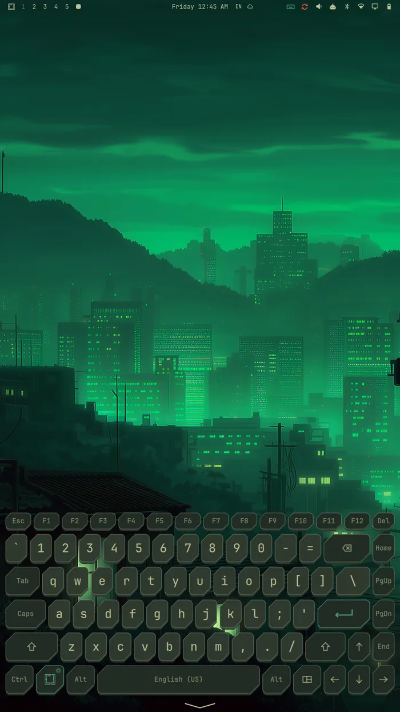
  &nbsp;
  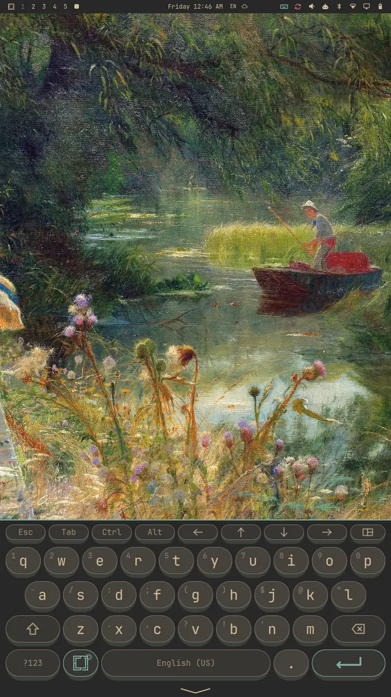
  <br>
  <sub>The same screen turned upright: <b>75%</b> with Spaceship on Osaka Jade, and <b>Mobile</b> with Typewriter on Gruvbox</sub>
</p>

**Mobile** is the three letter rows with symbol pages behind a `?123` key,
which is what a phone keyboard is and what Ragtop drew for its whole life
until now.

**60%** is five rows and fifteen units across, every symbol on the board
where your fingers already know it is, and no function row, no nav cluster
and no arrows. An **Fn** key sits where a full board keeps its right Super
and reaches all of it.

**75%** is the compressed one: a function row on top and one more column hard
against the right of the main block, no gap, which is the whole idea. Sixteen
units. Arrows in the bottom row, Del, Home, PgUp, PgDn and End down the right.
It has no room for a Menu key, so the tiling key holds it.

The function row on both of these is drawn shorter than a row of letters, the
way the mobile board's extra row is, because it is the same class of key: one
you reach for rather than type on. That is not only tidier. A six row board
is stopped by the height cap long before it runs out of width, so the short
row is what buys the other five their place.

**80%** is a tenkeyless: the function row grouped in fours and the full three
wide nav cluster past a gap, with the arrows in an inverted T below it.
Eighteen and a quarter units, and the only board with room for a Menu key of
its own.

**Automatic**, the default, draws the widest board the screen can carry and
changes its mind when the screen turns. A key may not go below 48 pixels,
which is Material's minimum touch target, and that minimum scales with Key
Size, because Key Size is exactly how big keys need to be for your fingers:
asking for larger keys asks for a simpler board sooner. A board may also not
take more than half the height, so the window underneath keeps the other
half.

Pick one by name and it is taken at its word on height, since asking for it
is asking for the height it needs. It still gives way on width, because a
board too wide for the screen cannot be drawn at all.

Measured on a 1366 by 768 machine, Automatic works out as:

| Key Size | landscape | portrait |
| --- | --- | --- |
| Smaller | 80% | 75%, since 80% wants 787px of width |
| Regular | 80% | 60% |
| Larger | Mobile | Mobile |

Landscape is decided by height and portrait by width, which is worth knowing
when one of them surprises you. At Regular there is width to spare for a
tenkeyless either way round, and in portrait it still falls to the 60%
because 768 pixels will not carry eighteen units of board at that key size.
At Larger nothing with six rows fits the height cap at all, and even the 60%
is over, so both orientations land on the mobile board.

Every row of a real board is built as the fifteen unit main block and then
whatever clusters that form factor puts to the right of it, so the block ends
in the same place on every row and the clusters line up down the edge. If your
layout turns out not to have some key, the block stretches back to fifteen
units by its own ends rather than handing the width to a nav key.

The 60% board is drawn ANSI shaped whatever your layout. An ISO board's tall
Enter is a keycap shape and nothing on a screen you tap is better for
reproducing it. What an ISO layout does get is its extra key beside the left
Shift, and only where that key reaches something the rest of the board
cannot: measured across layouts, a US or Dvorak one only repeats what `,` `.`
and `\` already type, while German, French, Spanish, Italian and Swedish
reach `<` and `>`, British `\` and `|`, and Russian `|`.

**Esc sits where the tilde key would**, as it does on a real 60%, and holding
it gives you `` ` `` and `~`. A desktop with no Escape is worse off than one
that reaches a backtick by holding.

**The right Alt is AltGr only where your layout has a third level to reach**,
and a plain Alt where it has not, which is what that key is on a US board. It
is the same call the mobile board makes by leaving its AltGr key out
altogether: a key that reaches nothing is worse than no key.

**There is one Super, and an Fn key where the second one would be**, which
is what a 60% does with that key and the reason it can reach anything at all.
A second Super exists so a touch typist can hit one without leaving home
position, and nobody touch types on this. Holding the Super opens Ragtop's
controls, as it does on the mobile board.

**Fn is a layer, and it latches like the other modifiers**: tap it for the
next key, tap it again to lock it on. Holding a physical Fn is easy and
holding one corner of a screen while tapping another is not. While it is on,
the caps change to say what they do, so there is nothing to memorise:

```
        F1 F2 F3 F4 F5 F6 F7 F8 F9 F10 F11 F12  Del
                          PgUp  Up   PgDn
                    Home  Left  Down Right  End
                                        tiling -> Menu
```

The arrows are an inverted T rather than a row of four, because a finger aims
by shape even when the key says what it is.

**Tiling mode is a tap on every real board**, in the place a full keyboard
keeps its right Super, for the same reason Fn takes that key on the 60%. The
context menu is behind it: hold the tiling key for Menu, or on the 60% reach
it with Fn. A screen has no right click, so Menu is worth having at all, but
arranging windows by touch is something you do constantly and Menu does
nothing whatever in a terminal. The 80% has the room to keep a Menu key as
well, and does.

### What every board has

- **An extra row**, on the mobile board, of Esc, Tab, Ctrl, Alt and the arrow
  keys. Held arrows and Backspace repeat. A real board has those keys in
  their own places instead.
- **One-shot modifiers:** tap Ctrl, then C, for Ctrl+C, and the Ctrl turns
  off by itself. Tap a modifier a second time to lock it on until you tap it
  again, however long you take over it. **Shift is the exception on a board
  that has a Caps key**, where it only ever latches: locking is what Caps is
  for, and one keyboard offering two ways to do one thing is one too many.
  Tapping Shift while Caps holds it still lets go.
- **Your layout's letters:** the letter keys follow the active Hyprland
  layout, and the space bar shows its name. **Hold the space bar** to switch
  to another of the layouts you have configured in Hyprland, if you have
  more than one. It is Hyprland's own switch, so everything follows it.
- **AltGr, where your layout has one.** A German q carries `@`, a French a
  carries `æ`, and every cap prints its AltGr character small in the corner
  the way a real keycap does. Tap AltGr and the caps switch to it, the way
  Shift switches them to capitals. The key only appears on a layout that has
  a third level, so a plain US keyboard is not given one that does nothing.
- **Hold a letter for its accents:** e gives é è ê ë, c gives ç, s gives ß.
  Slide onto the one you want and let go. Let go where you started for the
  plain letter, or slide off the popup to take nothing. The letters your own
  layout carries come first. On AZERTY, which keeps é, è, ç and à on its
  number row where the letter rows can't reach them, this is the only way to
  type them.
- **Your layout's symbols:** the two symbol pages carry the same punctuation
  whatever you type in, and pick up what your layout adds on top, § and ° on
  a German keyboard, ¡ and ¿ on a Spanish one, № and ₽ on a Russian one, ₹ on
  an Indian one. Up to four go in the free slots on the pages' third rows. A
  US layout adds nothing, so its pages look exactly as they always did.
- **Hold a letter for the digit and symbol above it:** the letter rows carry
  what the symbol pages draw in the same place, so on a US layout holding r
  gives `4` and `$`, the way the key on your desk prints both. Which symbols a
  letter carries comes from your layout, so holding 4 on the `?123` page gives
  `$` on a US keyboard and `'` and `{` on a French one, where the digit is the
  shifted level and the symbol is the plain one.
- **Hold the period for punctuation:** `,` `?` `!` `:` `;` `"` `'` `-`, with
  your layout's own marks first, ¡ and ¿ on a Spanish keyboard, « » on a
  French one, ، and ؛ on an Arabic one. Punctuation is nearly universal and
  not quite, so the ones that are yours alone come first.
- **Any character** your layout can't type still arrives, and every key types
  what it shows whatever your Hyprland layout is.
- **Super beside the space bar**, carrying Omarchy's own mark, where the key
  every Omarchy binding is written around sits on the keyboard you just folded
  away. **Hold it** for Ragtop's own controls, which come up over the keyboard
  so the keys stay in view while you change them. A small gear in the corner
  of the key says so, the way a cap prints what AltGr types on it. See below.

<p align="center">
  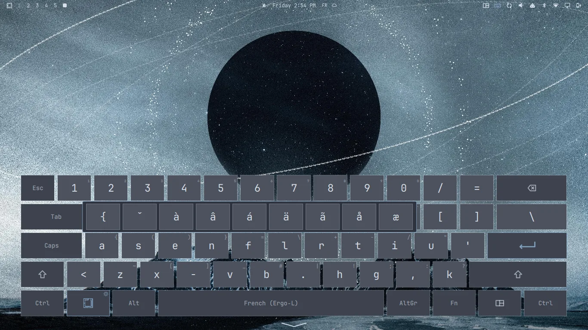
  <br>
  <sub>Holding a letter for its accents. The letters are the active layout's own, here French Ergo-L, which is why the home row is not QWERTY</sub>
</p>

`keyboard-helper.py` sends the keys: it registers a Wayland virtual keyboard
with the same keymap as your physical keyboard, which is also why your SUPER
shortcuts work from it. For keybindings or scripts:

```bash
omarchy-shell ragtop toggleKeyboard    # also showKeyboard, hideKeyboard
```

### The controls

Holding Super opens a small panel that sits below Omarchy's bar and holds
what you reach for while actually holding the machine. It is never taller
than half the screen, which is where Automatic stops the keyboard growing, so
the two cannot meet, and anything that does not fit scrolls. The keyboard stays
drawn underneath, so changing the theme or the key size shows you the result
as you do it. Tap anywhere on the keyboard to put it away.

A tap on Super is still Super, and rolling off it into another key still
works: hold Super, tap B, and the browser opens with Super applied. Only a
hold that stays put long enough to be a hold reaches the panel.

It is built from Omarchy's own panel components, so it is one of Omarchy's
popup menus rather than a panel of Ragtop's: square cornered where your
windows are square, rounded where they are rounded, and in the popup palette
rather than in the keyboard's theme. It is also only as tall as its contents
and never wider than the screen, which on a portrait display it used not to
be. It now draws over a notification that was already up when you opened it.
One that arrives while it is open still lands on top, because Omarchy maps
its notification surface when a notification appears and the newer surface
wins.

| Control | What it does |
| --- | --- |
| Theme | Steps through your themes, redrawing the keyboard behind each one |
| Keyboard Layout | Auto-select, Mobile, 60%, 75% or 80%, the same choice as Setup › Tablet › Layout |
| Screen Rotation | Locked, Unlocked, or Auto-rotate, which turns while in tablet mode and holds still in laptop mode. Locked adds **Rotate left** and **Rotate right**, each with a curved arrow showing which way it goes, since with the sensor held off there is nothing to undo a turn by hand. They are Hyprland and not the sensor, so they work on a machine that has no accelerometer at all |
| Keyboard Size | A slider against whatever size the theme asks for, with an **Auto-resize** that asks the screen instead. It reads how many pixels the display has to the millimetre and aims for a key about a centimetre and a half wide, which is a keycap. It is a preference rather than a promise: a board already filling the width cannot grow into it |
| Auto-expand keyboard on text fields | Whether the keyboard comes up by itself |
| Settings | Opens Setup › Tablet for everything else |

Tablet Mode is deliberately not here. Turning it off takes the keyboard away
with it, and the way back would be the menu this panel exists to save you
from. It stays in Setup › Tablet, where you can reach it without a keyboard.
The keyboard's own On / Off / Follow Sensor is not here either, for the same
reason: turning it off would take away the panel you turned it off from. It is
the bar button, which is always there whether or not there is a keyboard.

**Screen rotation** is also in the bar and the button there cycles the same
three states. Rotation follows the sensor whether or not the machine is in
tablet mode, so the screen can start turning while it is still a laptop, which
is why Unlocked and Auto-rotate are different things.

What the button draws is the setting, and one fault. The accent says you have
picked something other than Auto-rotate. A line through the arrow says the
screen is not going to turn. The urgent colour is kept for exactly one thing,
an accelerometer that is there and has stopped answering, which is the only
state on this button worth an alarm and the only one with something to do
about it. Absence is never an alarm.

**On a machine with no accelerometer the button is not there at all.** A
touchscreen with no sensor, a kiosk or a desk panel, can do nothing with two
of the three states, and a button that cycles three where one matters is worse
than no button. Nothing is lost: Locked and the two Rotate buttons stay in the
controls panel, which is where you want them anyway, since you watch the
screen turn as you tap. Ragtop asks `iio-sensor-proxy` whether there is an
accelerometer rather than inferring it from a sensor that never answers, so a
machine that simply has not got one is never told something is broken.

**The keyboard button** sits beside it, also always visible, and cycles
whether there is an on-screen keyboard at all: **Follow Sensor**, which is
tablet mode as before, **Always On**, which offers it in laptop mode too, and
**Always Off**. It takes the accent for anything but Follow Sensor, and the
key is struck through while it is off. Turning it
off is not the same as leaving tablet mode: tiling mode, the patched overlays
and the rotation rules all still follow the switch. The same three are in
Setup › Tablet › Keyboard, and `omarchy-shell ragtop cycleKeyboardMode` binds
to a key.

### Keybindings

Ragtop writes no keybindings of its own. If you want them, these are the ones
worth having, in `~/.config/hypr/bindings.lua`:

```lua
-- The keyboard, whatever the tablet switch thinks
bind("SUPER SHIFT", "K", "exec", "omarchy-shell ragtop toggleKeyboard")
-- The panel a hold on Super opens
bind("SUPER SHIFT", "T", "exec", "omarchy-shell ragtop toggleControls")
-- Locked, unlocked, automatic, round again
bind("SUPER SHIFT", "R", "exec", "omarchy-shell ragtop cycleRotation")
-- Bigger and smaller keys
bind("SUPER SHIFT", "equal", "exec", "omarchy-shell ragtop growKeyboard")
bind("SUPER SHIFT", "minus", "exec", "omarchy-shell ragtop shrinkKeyboard")
```

Check them against Omarchy's own bindings before you add them, since nothing
here reserves a chord.

Everything on that socket takes no argument, deliberately: `showKeyboard`,
`hideKeyboard`, `toggleKeyboard`, `keyboardVisible`, `openSetup`,
`closeSetup`, `toggleControls`, `cycleRotation`, `growKeyboard`,
`shrinkKeyboard`, `rotationState`, `keyboardState` and `pickerState`. None of
them can be handed a value to type, which is the point.

### The keyboard's look

Ragtop follows your Omarchy theme: colours, type scale, spacing and borders
all come from the theme's own tokens, so switching themes restyles the
keyboard with it. The settings only say *how* to use them, and each one is a
row in the Omarchy menu under **Setup › Tablet**:

| Row | Choices |
| --- | --- |
| Tablet Mode | Automatic (follow the hardware switch), Always On, or Always Off |
| Keyboard | Follow Sensor, Always On, or Always Off: whether there is an on-screen keyboard at all |
| Layout | Automatic, Mobile, 60%, 75% or 80% (TKL): which board it draws |
| Auto Keyboard | Whether the keyboard comes up by itself on a text field |
| Theme | The keyboard's whole look, from a theme file |
| Key Size | Automatic, or Smallest, Smaller, Regular, Larger, Largest against whatever size the theme asks for, and the labels scale with the keys |
| System Overlays | Touch typing in each of Omarchy's overlays, one at a time |
| Run Setup | Opens setup in the shell |
| Diagnostics | Copies everything a bug report needs to the clipboard |

Theme, Layout, Key Size, rotation and the keyboard's own auto-expand are also
on the panel a hold on Super opens, which is the quicker way to them while you
are holding the machine.

What a key looks like, its shape, relief, fill, how see-through it is, the
background behind it and the top edge, belongs to the theme, so it is set in
a theme file and not row by row. What stays here is the one thing no theme
author can know: how big the keys have to be on your screen for your eyes.
Key Size is a nudge against whatever the theme asked for, and it is yours, so
applying a theme never resets it.

**Whether the keyboard has a background at all is Omarchy's call, not a
setting here.** Double-tap the bar to make it transparent and the keyboard's
background goes with it, so the keys float over the desktop the way the bar
does. Make the bar solid again and the background comes back as the theme
asked for it.

Whatever a key looks like, a touch goes to the nearest key, so no shape
makes keys harder to hit.

**Edge** sets how the keyboard's top edge meets the desktop. Border gives it
the same border your tiled windows have, taken from the Omarchy theme itself
(the shell's own active-window border spec), so it follows a theme switch
live, gradients included. Fade fades the background out over `edge-fade`
pixels. None leaves a hard edge.

### Themes

A Ragtop theme is a small TOML file, never code. It sets the keyboard's
**form**. Its colours keep coming from your Omarchy theme, which is why any
Ragtop theme looks right on any Omarchy one.

Six ship: Omarchy, Soft, Typewriter, Glass, Industrial and Spaceship. Apply
one from the menu or with `./ragtop theme apply <name>`. Yours go in
`~/.config/ragtop/themes/<name>/ragtop.toml` and win where the names match.

| | |
| --- | --- |
| 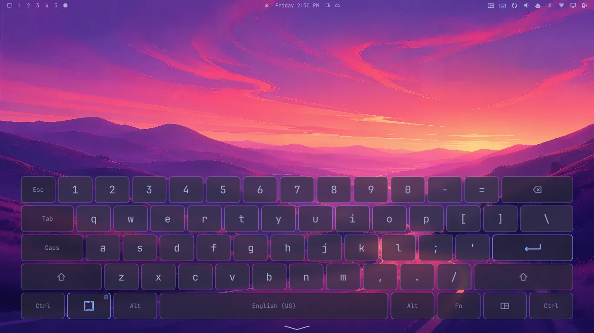 | 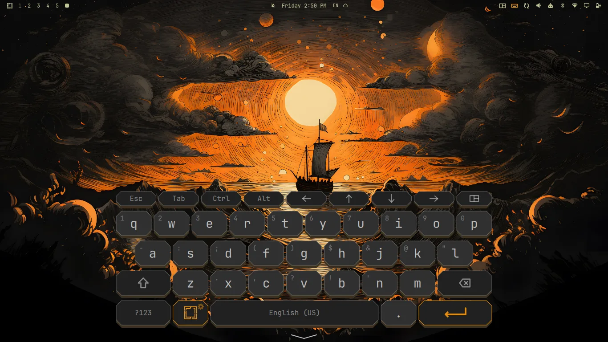 |
| **Glass** on Tokyo Night, see-through keys over the wallpaper | **Industrial** on Matte Black, the mobile board in landscape |

Applying one **writes its values into your settings**, so afterwards every
menu row shows what the keyboard is actually doing. A theme is a starting
point, not a layer that overrides you. It is also a whole look rather than a
patch: every field a theme does not name goes back to its default instead of
keeping whatever the last theme left behind.

**[THEMING.md](THEMING.md) is the full reference**: every field, its values
and its default, the corner system, and the shipped themes read back as
worked examples.

**Blur** is Hyprland's, and Omarchy ships with it turned off. A theme with
`blur = true` turns it on at runtime, for Ragtop's keyboard and its handle
only: Hyprland is told to leave every window unblurred, so your see-through
terminals stay as they are. Turning blur off again restores it, and nothing
is written to your Hyprland config, so `hyprctl reload` clears it either
way. If you have blur on yourself, Ragtop leaves your setup alone and just
blurs behind its keyboard.

The lock screen's keyboard takes the shape, fill and measurements too,
checked again by its own code, but never the colours or the background.

## Tiling mode (preview)

Omarchy windows have no title bars, and moving or resizing them needs SUPER
and a mouse. Tiling mode gives you the same thing with a finger.

**This one is a preview.** It is good on a single screen and it is not
finished on more than one. Ragtop draws the outlines for the screen it lives
on, so windows on another monitor cannot be reached from it at all, and what
it does do across several displays still has rough edges. Use it, report what
you hit, and do not be surprised by it. Everything else in Ragtop is meant to
be solid.

It is named after Omarchy's own `bindings/tiling.lua`, which groups exactly
these actions: split, float, tiled full screen, full width, the scratchpad and
the workspaces. This is that file, reachable by touch.

Get in by tapping the tiled icon at the end of the keyboard's top row, or
the grid icon in the bar. The keyboard steps aside and a transparent layer
covers the real windows, outlining each one with its title and size.

The windows themselves are the controls. They stay at full size with their
own content visible, and they reflow as you work, which is the whole reason
it happens over them rather than over a scaled-down map.

<p align="center">
  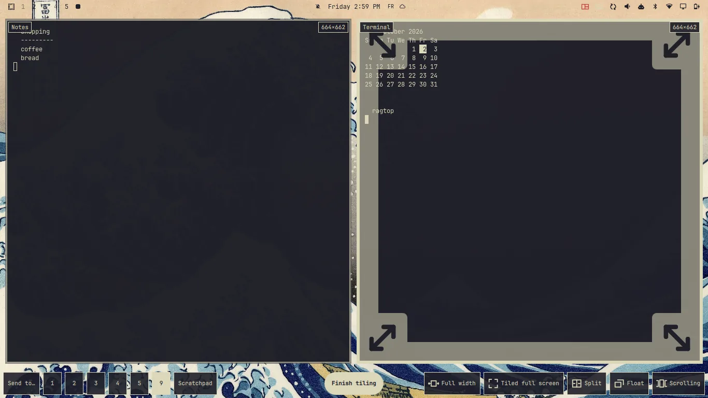
</p>

Two tiles with their handles up, and the strip along the bottom: the
workspaces and the scratchpad on the left, the shapes on the right, and the
way out in the middle.

| To | Do |
| --- | --- |
| Focus a window | Tap it. |
| Move one | Press and hold it for a moment. It shrinks to an outline you drag. Let go over another window to swap the two. |
| Resize | Drag the squares in a window's corners, or the bars along its edges. A corner moves both directions at once, an edge moves just that split. |
| Move a floating window | Drag it. It goes where you put it, with no hold and no outline, because a float already has a position of its own. |

Holding before dragging is what separates moving from tapping, so a tap that
wanders slightly still counts as a tap. The outline you drag **is** the
window, shrunk, rather than a copy left behind to explain.

A tiled window dropped onto a floating one swaps them: the float takes the
tile's place at full size and the tile becomes floating where the float was.
The other direction is a plain move, since a float has nowhere it needs to
be put. A float covering something you want is easiest solved by dragging
the float out of the way first.

Along the bottom, where the keyboard's handle sits, is everything a finger
cannot say by dragging:

| Control | Does |
| --- | --- |
| Send to | Arms the workspace keys, so the next one moves the window instead of going there. |
| 1 to 10, Scratchpad | Go to that workspace, or send the window there when Send to is armed. |
| Full width | Maximises without going truly full screen, so the keyboard is still reachable. |
| Tiled full screen | Omarchy's tiled full screen, SUPER+CTRL+F. See below, it does something you might not expect. |
| Split | Flips the split under the focused window. |
| Float | Floats or unfloats it. |
| Scrolling | Switches Hyprland to its scrolling layout, and back to the one you were on. This is the compositor's own layout setting, so it changes every workspace and not just this one. |
| Finish tiling | Leaves. |

**The shape buttons light up when what they do is already true**, so Float
tells you the window is floating and the two full screen buttons tell you
which kind of full screen it is in. Both kinds can be on at once. They are
separate settings in Hyprland and neither cancels the other.

**Tiled full screen greys out while a window floats**, and so does Split.
Neither means anything without a tile. Hyprland suspends tiled full screen
the moment a window floats and restores it when the window tiles again, and
Split turns the divider of the tile a floating window does not have.

### What tiled full screen actually does

It does not resize anything. The window keeps its tile and stays exactly
where it is. What changes is that the window is **told** it is full screen,
and applications react to that by hiding their own chrome. A browser drops
its tab strip and address bar, the way it would on F11.

So it means "give me the app's full screen view without giving up my tile",
which on a small screen is worth 80 to 120 pixels of content in a browser.
It is also easy to forget you are in, because a browser with no tabs looks
broken until you remember why. That is what the light on the button is for.

**Full width** is the other one and does the opposite: it changes the
geometry and tells the application nothing, so a browser keeps its tabs.

### Grouped windows

Omarchy can tab several windows into one tile, on SUPER+G. Tiling mode draws
a group once, as the single tile it occupies, rather than once per tab. The
group's own tab bar sits above the outline and is what says which window is
on top.

Moving or swapping a group moves all of it and keeps it together, because
as far as the layout is concerned a group is one tile.

### Leaving, and turning it sideways

Turned on its side there is less width and more height, so the strip along the
bottom becomes two rows rather than hiding anything behind a scroll.

Tiling mode ends when you tap Finish tiling or the bar's own button, when the
keyboard comes back by any route, when tablet mode ends, and after 90 seconds
of nothing happening.

One limit worth knowing before it surprises you: a boundary between two
*groups* of tiles resizes the whole group, because the layout is a tree and
that edge belongs to the branch rather than to one window. See
[Known limitations](#known-limitations).

## Omarchy's overlays

Omarchy's menu, pickers and polkit prompt are full-screen surfaces that take
*exclusive* keyboard focus, and Hyprland sends every touch to such a surface
before checking anything stacked above it. So a tap on the on-screen keyboard
lands on the overlay and closes it. This can't be fixed from the keyboard's
side.

The theme and background pickers (both Omarchy's image picker) have the same
problem and one of their own: see [The theme and background
pickers](#the-theme-and-background-pickers).

Ragtop can replace them with clones (made with Omarchy's own
`omarchy plugin clone`) that change two lines, and only in tablet mode: they
take focus *on demand*, which still gets focus when they open and still
receives typed keys, and they respect the keyboard's reserved space so they
sit above it. In laptop mode they behave exactly as shipped, and on-demand focus
there could let a window under the mouse on another monitor take focus away.
The menu's clone carries one more change, for a reason that has nothing to do
with touch: see [The menu's Apps list](#the-menus-apps-list).

Replacing part of Omarchy is your call, so each clone is off until you turn it
on. The installer offers all of them once, with the trade-off below and No as
the default answer. Afterwards, in the Omarchy menu, go to
**Setup › Tablet › System Overlays** and
tap an overlay to turn it on or off (✓ means on). The shell restarts to load
the change. From a terminal, the same thing is:

```bash
./ragtop overlay toggle menu        # or: enable, disable; menu, emojis, clipboard,
                                    # polkit, image-picker, lock
./ragtop overlay status             # which are on, and in sync with Omarchy?
./ragtop overlay sync               # re-clone any that Omarchy or Ragtop moved on from
```

What turning one on means:

- **It stops getting Omarchy's fixes directly.** A clone is a copy, so once it's
  on, Omarchy's updates to the original don't reach it by themselves. A hook
  re-clones it after every `omarchy update`, but refuses to replace a clone
  you've edited yourself, and tells you so.
- **In tablet mode it doesn't hold the keyboard to itself.** That's the fix,
  but it also means another window could take keyboard focus while the overlay
  is open, for example one under the mouse on a second monitor, and receive
  what you type.
- **The password prompt matters most.** Its clone keeps its authentication role
  (Omarchy passes a clone its original's capabilities), but its code then lives
  in your user-writable config instead of the root-owned system folder, and the
  point above applies to your password. Anything running as you could already
  interfere with your session in other ways, but it's the one to think about
  before turning on.

### The menu's Apps list

Omarchy 4 (checked on 4.0.4) doesn't give a third-party menu plugin its
application library. The plugin's manifest reaches the shell's plugin API
through an `Instantiator`, and after that round trip
`Array.isArray(manifest.kinds)` is false, so the shell decides the plugin
isn't a menu and builds it without one. Omarchy's own menu is unaffected,
because it gets the shell itself. Any cloned menu, Ragtop's or anyone's, comes
up with **Apps** empty.

So the menu clone carries a third change: when the shell hands it no
application library, it loads Omarchy's own `AppLibrary.qml`, the same file
the shell uses, which stands on its own, and goes back to the one the shell
provides the moment there is one. Apps, its icons and launching all work the
way they do in Omarchy's menu. The only cost while the fallback is in use is
one extra icon scan.

### The theme and background pickers

Both are Omarchy's image picker (**Image Picker** in the same menu), and it
isn't a keyboard problem: it shows a carousel of previews, and the keyboard
covers the very preview you're choosing by. So Ragtop keeps the keyboard off
it and, with the clone on, puts the four keys the carousel actually listens
to in a strip along the bottom instead:

```
   [ ◀ ]   [ Select ]   [ ▶ ]      [ Cancel ]
```

◀ and ▶ step through the images and repeat if you hold them. Select applies
the one in the middle, and Cancel closes without changing anything. The strip is
drawn from the keyboard's own theme and reserves its space, so the carousel
sits above it. The keyboard handle stays, so you can still bring the keyboard
up to type a filter where the picker takes one.

<p align="center">
  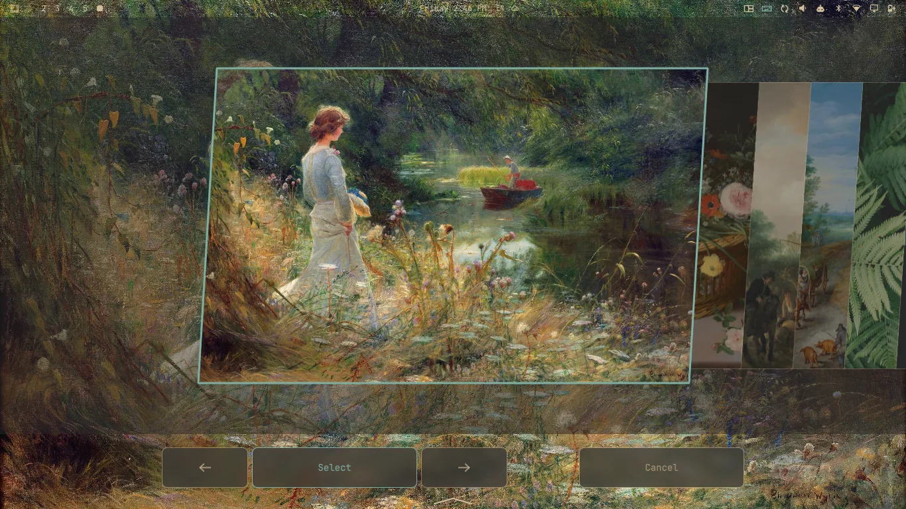
</p>

Without the clone Ragtop can only get out of the way: a stock picker takes
every touch on the screen, so the strip's own taps would never reach it, and
even a tap on the keyboard would land on the picker and throw it away. So
whether or not you turn the clone on, while a picker is open the keyboard
stays down and the handle goes with it, leaving the carousel's own slices to
tap: tap one to select it, tap the middle one again to apply.

One cost specific to this clone: Omarchy warms the picker's thumbnails
through an IPC call that names the built-in plugin directly, so with any
clone in place that warm-up does nothing and the first open is slower. The
picker itself opens, works and closes normally.

### The lock screen

The lock screen is different: while it's up, Hyprland shows nothing else at
all, so no on-screen keyboard can appear over it. Its clone (**Lock Screen**
in the same menu) keeps Omarchy's lock screen as it is and adds a keyboard of
its own along the bottom, in tablet mode only: your layout's letters with
Shift (tap twice for Caps), and two pages of digits and symbols, which pick
up your layout's own symbols the same way the desktop keyboard's do. Holding
a letter offers its accents there too. A password is typed in characters,
and on some layouts é or ß is only reachable that way. Its popup sits on a card of
its own, opaque whatever the theme's key transparency is, so the letter you
are picking stays legible against the keys it covers. The keys edit
the password the same way typing does, and Omarchy checks it as usual. The
keyboard itself is `LockKeyboard.qml` in Ragtop's folder, which the clone
loads.

<p align="center">
  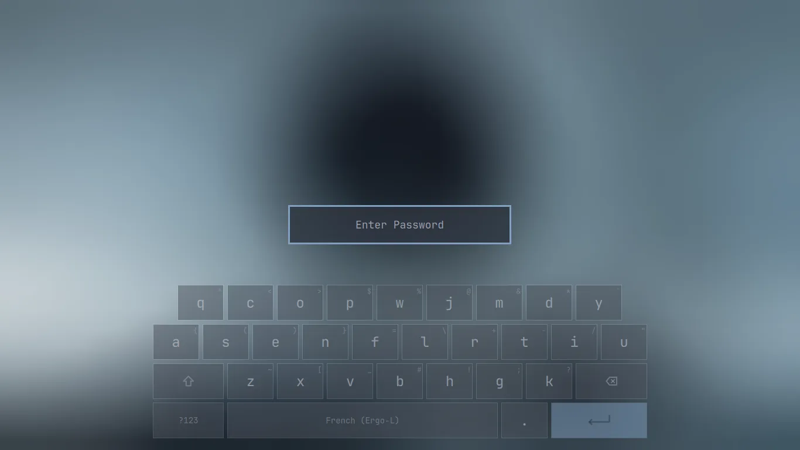
</p>

It's shaped like the desktop keyboard but drawn in the lock screen's own
colours, and it's deliberately a separate, self-contained file: it shares no
code with the desktop keyboard, sends no key events and has no Ctrl, Alt or
Super, so nothing added to the desktop keyboard reaches the lock screen by
accident, and there's one short file to review. It learns your layout's letters
and symbols from `$XDG_RUNTIME_DIR/ragtop-layout.json`, which Ragtop's service
writes, and falls back to US if that's missing or malformed. What it takes
from there is data, never code, and it re-checks all of it by its own rules:
a symbol has to be one printable character or it's dropped.

The screen doesn't rotate while it's locked, with or without this: Omarchy's
lock screen isn't redrawn for a rotated display, although touches would be
rotated, so taps would land in the wrong place. The lock screen keeps the
orientation it was locked in, and the screen catches up when you unlock.

The same points apply as for the password prompt, since this is where you type
your login password: the clone and the keyboard live in your user-writable
config. Keys light up when tapped, as on any on-screen keyboard, so mind who's
watching. Try it the first time in laptop mode with Tablet Mode set to
Always On, so the physical keyboard is there if anything goes wrong.

## Settings

Ragtop's settings are in the Omarchy menu under **Setup › Tablet**, which
the Settings button on the keyboard's own panel opens directly:

| Setting | Default | Where |
| --- | --- | --- |
| Tablet mode: Automatic (follow the hardware, folding or detaching), Always On or Always Off | Automatic | Setup › Tablet › Tablet Mode |
| Which board the keyboard draws: Automatic, Mobile, 60%, 75% or 80% | Automatic | Setup › Tablet › Layout |
| Which monitor Ragtop uses: Auto-detect, or a monitor by name | Auto-detect | the controls panel, where there is more than one |
| Turn the screen a quarter turn by hand | n/a | the controls panel, while Screen Rotation is Locked |
| On-screen keyboard: Follow Sensor (on in tablet mode), Always On or Always Off | Follow Sensor | Setup › Tablet › Keyboard, or the keyboard button in the bar |
| Keyboard comes up on text fields | on | Setup › Tablet › Auto Keyboard |
| A saved look, which writes the rows below (see [Themes](#themes)) | Omarchy | Setup › Tablet › Theme |
| Key size against the theme's: Automatic, a percentage from 60 to 160, or one of five names | Automatic where you have not set one | the controls panel's slider, or Setup › Tablet › Key Size |
| Key shape, relief, fill, transparency, background and top edge | set by the theme | `themes/<name>/ragtop.toml` |
| Whether the keyboard has a background | follows the bar | double-tap Omarchy's bar |
| Touch typing in each overlay, the picker nav strip, and the lock screen's keyboard | off | Setup › Tablet › System Overlays (see [Omarchy's overlays](#omarchys-overlays)) |

The bar follows Style › Bar › Transparency, which a double tap on it
toggles: a transparent bar takes the keyboard's background away entirely, and
a solid one gives back whatever the theme asked for. The handle along the
bottom follows the bar the same way while the keyboard is closed, and the
keyboard while it's open.

From a terminal, `./ragtop <setting> ...` does the same as the menu rows:
`tablet-mode set auto|on|off`, `keyboard set sensor|on|off`,
`keyboard-layout set auto|mobile|60|75|80`, `display set auto|<monitor>`,
`auto-show toggle` (or `enable`, `disable`),
`size-adjust set auto|<60-160>|smallest|smaller|regular|larger|largest`,
`rotation set locked|unlocked|auto`, and
`theme apply <name>` (`theme list` shows them). Settings other than the
overlays are kept in `~/.config/ragtop/settings.conf`, and changes apply
straight away. The rest of the look has no verb, because it is the theme's
to set.

One more lives in Ragtop's bar entry in `~/.config/omarchy/shell.json`:

| Setting | Default | Meaning |
| --- | --- | --- |
| `tabletSwitchDevice` | blank | Input device to read the tablet-mode switch from. Blank means auto-detect. |

The rotation button writes `rotation` to `settings.conf` like every other
setting, so an old `rotationLocked` or `rotationMode` left in `shell.json` is
read by nothing and can go.

## Tablet-mode detection

Ragtop picks the input device that advertises the standard tablet-mode
switch (`SW_TABLET_MODE`) and watches it, so a fold registers immediately.
If none exists yet, it
keeps looking every 10 seconds, which covers keyboards that attach later.

If your device has no usable switch, or you want the touch controls with the
keyboard attached, set **Setup › Tablet › Tablet Mode** to **Always On**.
Always On and Always Off stop Ragtop reading the switch at all.

If tablet mode is never detected:

- Check the installer's "Looking for a tablet-mode switch" output. No device
  means your driver doesn't report the switch. Setting `tabletSwitchDevice`
  won't help then.
- A device that isn't readable is usually owned by the `input` group. Rather
  than joining that group, which would let any program you run read every
  keyboard, the installer offers to install
  `/etc/udev/rules.d/70-ragtop-tablet-switch.rules`:

  ``` SUBSYSTEM=="input", KERNEL=="event*", ENV{ID_INPUT_SWITCH}=="1",
  ENV{ID_INPUT_KEY}!="1", TAG+="uaccess" ```

  It gives the user logged in at the machine read access to switch devices
  only (tablet mode, lid, headphone jack), never keyboards, and takes effect
  without logging out. The uninstaller removes it.
- Rotation is separate: it needs `iio-sensor-proxy` to see your accelerometer
  with the right orientation, which is handled by your distribution's hardware
  database, not Ragtop.

## Known limitations

True today, and worth saying if you want them gone:

- **No swipe typing.** Keys are tapped one at a time.
- **No CJK input.** Chinese, Japanese and Korean need an input method engine
  and somewhere to put the candidates. See [Chinese, Japanese and
  Korean](#chinese-japanese-and-korean).
- **No dead keys, on purpose.** Accents come from holding a letter rather
  than from a dead key followed by one. A real board still *draws* the dead
  keys your layout has, in their own places and showing the mark they apply,
  because a keyboard with a hole in the middle of a row is worse than either
  answer. Tapping one types the mark itself. Ragtop types by character rather than
  by key position, so it reaches the composed letter directly and the two
  step route buys nothing on a screen you tap. What it would cost is a key
  that shows nothing, an armed state to display, and a second way to do what
  a long press already does. If your layout reaches something no long press
  offers, say so in an issue. That is the thing worth knowing, and enough of
  them is what would change this.
- **One layout at a time, and it is the system's.** Ragtop follows Hyprland's
  layout instead of keeping one of its own. Holding the space bar switches
  between the layouts you set there, and there is no picker of Ragtop's.
- **Automatic tablet mode needs a kernel switch.** A machine that reports none
  still works, set to **Always On**, and setup says so rather than failing
  quietly. See [Tablet-mode detection](#tablet-mode-detection).
- **Rotation needs `iio-sensor-proxy`.** Without it the screen holds still,
  and turning it by hand from the controls panel is the only way round. That
  half works with no sensor at all, since it is Hyprland rather than the
  accelerometer.
- **A touchscreen with no accelerometer gets no rotation button**, which is
  the right answer for a kiosk or a desk panel: two of the three rotation
  states cannot do anything there. Set rotation to Locked once, from the
  controls panel, and the two Rotate buttons turn the screen by hand. Ragtop
  asks `iio-sensor-proxy` whether an accelerometer exists rather than
  concluding it from claims that never land, so such a machine is never told
  that rotation is broken when there was never anything to break.
- **The keyboard takes every tap inside it.** A theme that draws no background
  at all is the exception, and then only the keys take one. There is no gap
  between keys to reach the window underneath.
- **Monitors are named by their maker, not their connector.** DP-1 is a
  socket rather than a screen, so the controls panel says LG or Samsung where
  the monitor reports something a person would recognise, and Built-in for the
  panel in the lid. It falls back to the connector where a monitor reports
  nothing useful, and keeps the connector alongside where two screens share a
  maker. Your laptop panel almost certainly reports its panel vendor and a hex
  model, which is why it is not called that.
- **Ragtop lives on one monitor.** The keyboard, its handle, the controls and
  tiling mode all go to the same screen: the one the compositor binds your
  touchscreen to if you have bound one, otherwise the built-in panel, and you
  can name a monitor yourself. Two screens of keyboard is not a thing anyone
  asked for. What it does cost is tiling mode, which shows the windows on
  Ragtop's own screen, so windows on another monitor cannot be arranged from
  it. Rotation is the exception and stays with the built-in panel, because
  that is the screen that physically turns.
- **Tiling mode is a preview, and multi-monitor is where it shows.** On one
  screen it does what it says. On more than one it reaches only the screen
  Ragtop is on, and the rest is known to be rough rather than known to work.
  See [Tiling mode](#tiling-mode-preview).
- **The screen does not rotate while locked.** Omarchy's lock screen is not
  redrawn for a rotated display, so it keeps the orientation it was locked in
  and catches up when you unlock.
- **Resizing a boundary between two groups of tiles resizes the whole group.**
  Omarchy's layout is a tree, so the line between two tiles is sometimes the
  edge of a group rather than of one window, and moving it shares the change
  across everything inside. A mouse does the same thing. Nothing can name a
  single split to move, so this is the layout showing through rather than
  something Ragtop gets wrong.
- **A cloned menu's Apps list is empty** on Omarchy 4 (checked on 4.0.4),
  which is an Omarchy bug rather than Ragtop's. Ragtop works around it and the
  workaround undoes itself once upstream lands a fix. See [The menu's Apps
  list](#the-menus-apps-list).

## What might come next

Not built, not promised, and written down so the thinking isn't done twice.
Each of these is here because it has a shape already, not because it is next.
What used to head this list, function keys and second meanings for the arrows,
is built: the larger boards have those keys in their own places and the 60%
reaches them through [Fn](#which-board).

- **A number row of its own, on the mobile board.** The real boards have one
  already. On the mobile board the digits a hold on a letter reaches come from
  where the two rows sit, which only lines up when a layout puts ten letters
  on its top row. Hebrew puts eight there and Dvorak seven, so on those the
  digits no longer sit under the letters that print them. None is out of
  reach, since the leftovers go on the nearest letter's card, two to a card,
  but a row of digits you can turn on, the way a phone keyboard offers one,
  is the honest fix.
- **Spellcheck and word prediction**, through Hunspell for the dictionary and
  fcitx5 for the plumbing. The unsolved part is not the spelling, it is where
  the suggestions would live on a screen whose bottom third is already keys.
  Hunspell would have to be installed separately, and the setting would appear
  only once it is, the way the rotation setting does with `iio-sensor-proxy`.
- **Chinese, Japanese and Korean.** See [Chinese, Japanese and
  Korean](#chinese-japanese-and-korean), which has the research and the one
  test that decides the size of it.
- **Whether a folded machine silences its own keyboard.** On a Lenovo Yoga the
  built-in keyboard and touchpad appear to stop reporting when the screen is
  folded back, which would mean Ragtop has nothing to do. Whether that is the
  hardware, the firmware or the kernel, and whether other convertibles do it
  at all, is unknown. If yours types into things while folded, please say so in
  an issue with the model: that is the report that would turn this into work.

## Troubleshooting

- **Changes to Ragtop's code don't take effect.** Run
  `omarchy-restart-shell`. Omarchy's plugin reload (`omarchy-shell shell
  rescanPlugins`) can keep running previously compiled code.
- **The bar icons are missing.** Look for a load error:
  `quickshell log -r '*=true' /run/user/$UID/quickshell/by-pid/$(pgrep -f 'quickshell.*omarchy/shell')/log.qslog | grep 'sclemance.ragtop failed'`
- **The keyboard doesn't type.** Check that `python-pywayland` is installed:
  the setup notification says so if it isn't.
- **Something stops working and nothing says why.** Four things run in the
  background: the key sender, the watcher that notices text fields, the
  tablet-mode switch watcher and the rotation sensor. Any of them can die
  while everything on screen still looks right. Ragtop now says so once, in
  the words of what you lost rather than the name of a process, and
  Diagnostics has a **Background** line that names whichever is failing and
  how many tries it has had. A process that keeps dying is restarted more
  slowly each time, up to once every five minutes, instead of every three
  seconds forever.
- **The screen stops following the device.** Ragtop says so, once, when an
  accelerometer that exists has failed to answer twice. It asks
  `iio-sensor-proxy` whether there is one first, so a machine that has none is
  never sent this, and Diagnostics says `no accelerometer on this machine`
  rather than blaming the daemon. `iio-sensor-proxy` can get into a state
  where claiming the accelerometer never returns, and
  `systemctl restart iio-sensor-proxy` clears it. Diagnostics says
  `sensor not answering` while that is true. Backing off matters more here
  than elsewhere: asking every three seconds is what keeps the daemon from
  recovering in the first place.
- **Reporting any of it.** Tap **Setup › Tablet › Diagnostics**. It puts the
  machine, the four versions, the screen and its scale, the tablet-mode switch
  and its read access, the keyboard layout, which of Ragtop's surfaces are up,
  the packages, the overlays and every setting on your clipboard, ready to
  paste into an issue.
  From a terminal it is `ragtop diagnostics`, and `ragtop diagnostics copy`
  does the same as the menu row.

  It also says where the code came from, because a linked working copy can
  hold edits that are in no commit and a folder copied in by hand never takes
  an update. It carries no paths under your home directory, no host name and
  no user name.

## Uninstall

```bash
./install.sh uninstall
```

This removes any overlay clones you turned on, Ragtop's rows in the Omarchy
menu, the switch access rule, Ragtop's settings and generated files, and the
plugin itself (or unlinks it, if it was linked from a checkout).

## Language

Ragtop is English-only, and so is Omarchy: the shell has no translation layer
yet, and the proposals for one are still open. That's worth fixing one day.
In 2026 localization isn't as hard as it used to be, and Linux is for
everyone, not just English speakers, so the point for now is to not get in
the way of it. [LOCALIZATION.md](LOCALIZATION.md)
records where that stands, which of Ragtop's strings are prose and which are
protocol that must never be translated, and what would change here once a
standard settles.

The keyboard itself is mostly language-agnostic already. Its letters, symbols
and accents come from your active Hyprland layout, and its key glyphs are
drawn rather than written.

### Chinese, Japanese and Korean

Not supported yet, and worth considering rather than ruled out.

The pipeline is already pointing the right way. Ragtop does not put characters
into applications, it sends key events through a Wayland virtual keyboard, and
every one of those passes through fcitx5, which is the thing that turns nihao
into a list of candidates. Ragtop sits upstream of the input method rather
than competing with it, so with an engine installed the typing half may
already work. Nobody has tested it.

What is missing is most likely the candidates rather than the keys. fcitx5
draws its candidate list near the text cursor, and on a 768 pixel screen with
a keyboard reserving the bottom third, a popup you have to reach with a finger
is the part that will not fit. That is a layout problem, not an input one.

If Ragtop has to draw the candidates itself, fcitx5 already has the protocol
for it. Its `VirtualKeyboardBackend1` interface offers `SelectCandidate`,
`NextPage` and `PrevPage`, which is the vocabulary a touch keyboard needs.
The unsolved piece is how an on-screen keyboard receives the candidate text,
since that interface has no signals carrying it.

So this is a day of testing to find out which of those it is, and then either
a paragraph of documentation or a candidate strip. If you would use it, say so
in an issue. Interest is what would move it.

Two things are already decided about how it would look. Switching engines
would be Ctrl+Space and not Super+Space, because Omarchy has Super+Space
already. And the characters need a font that carries them, which on Arch means
something like `noto-fonts-cjk`. Ragtop would say so rather than render
boxes, the way setup already does for its other dependencies.

## Upgrading from an older Ragtop

0.39 renamed presets to themes and moved them from `presets/<name>.json` to
`themes/<name>/ragtop.toml`, turned key size and the two transparencies from
words into numbers, and changed which rows live in the menu. A machine that
upgrades in place is brought up to date the first time the shell starts
afterwards, and told so once:

- **Settings** keep their meaning. `transparency=high` becomes `50`,
  `size=large` becomes `115`, `preset=` becomes `theme=`, and the modifier
  mode setting is dropped, since one-shot now locks on a second tap.
- **Your own presets** in `~/.config/ragtop/presets/` become themes in
  `~/.config/ragtop/themes/<name>/ragtop.toml`, converted as above. The
  originals are left where they are, and a theme you already have of the same
  name is never overwritten.
- **The menu** is rewritten, because the old rows call commands this version
  no longer answers.

None of it runs twice. If you would rather do it by hand, `./ragtop migrate`
is the same thing.

## Versioning and updates

`omarchy plugin update sclemance.ragtop` fast-forwards this checkout to the
default branch: it shows you the diff first, validates the manifest
afterwards, and rolls back if that fails. There are no release channels.
Whatever is on the branch is what you get, so the branch is kept shippable
and every push is, in effect, a release.

The version in `manifest.json` is required, since `omarchy plugin validate`
refuses a manifest without one, but Omarchy itself never shows it: not in
`omarchy plugin list`, not in its JSON. So it is here for people, in the
release tags and in bug reports.

**Ragtop is in beta, and the version is 0.x while that is true.** It runs two
machines every day and it wants strangers to break it, so bugs and hardware
reports are the point of this stage, and so is telling us what is awkward.
Features will change and be added meanwhile, because usability is not
something you finish before shipping and then stop doing. What 0.x says
honestly is that the settings file, the `ragtop` command and the rest are
still moving.

1.0.0 is simply the first release that is not beta, tagged like the rest,
and from there on:

| | |
| --- | --- |
| **patch** | a fix |
| **minor** | a new capability, or a changed default |
| **major** | a break in something you can build a habit or a script on: the keys and values in `settings.conf`, the `ragtop` verbs, the `setup.tablet.*` menu ids, the layer namespaces, the `ragtop` IPC target and its functions, the files in `$XDG_RUNTIME_DIR`, and the installer's flags |

Everything else, the QML, how a key is drawn and what the helper prints to
itself, is Ragtop's own business and can change in a patch.

## Credits and licensing

- The on-demand focus fix for Omarchy's overlays follows
  [Gimbal](https://github.com/mechanicsunlocked/gimbal) (MIT), a tablet mode
  for the Framework Laptop 12.
- `protocols/virtual-keyboard-unstable-v1.xml` is the Wayland virtual keyboard
  protocol (MIT). Its Python bindings are generated on your machine on first run.
- Clones of Omarchy's overlays are made on your machine from Omarchy's
  MIT-licensed source.
- Ragtop itself is released under the [MIT License](LICENSE).
